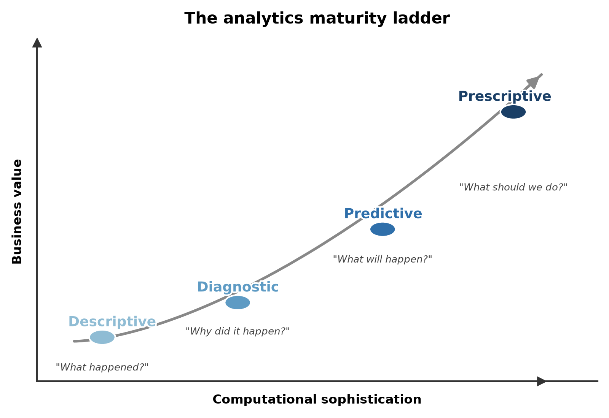
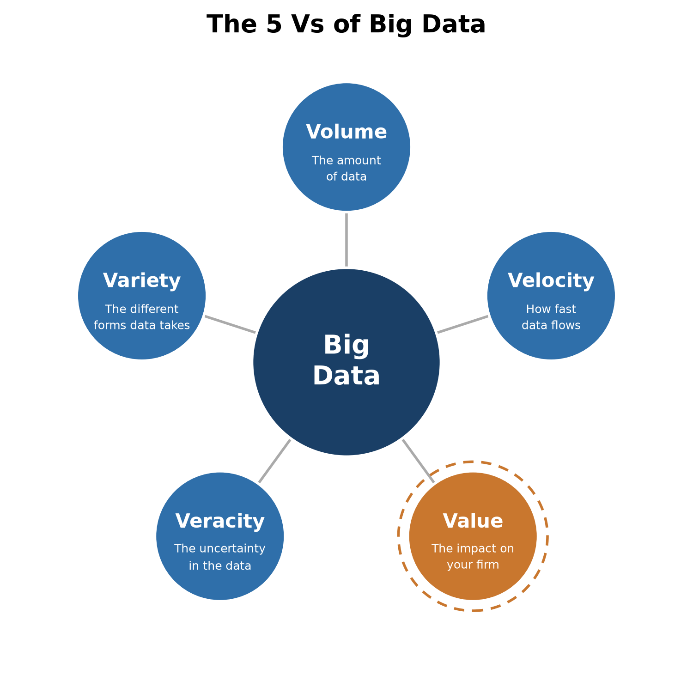
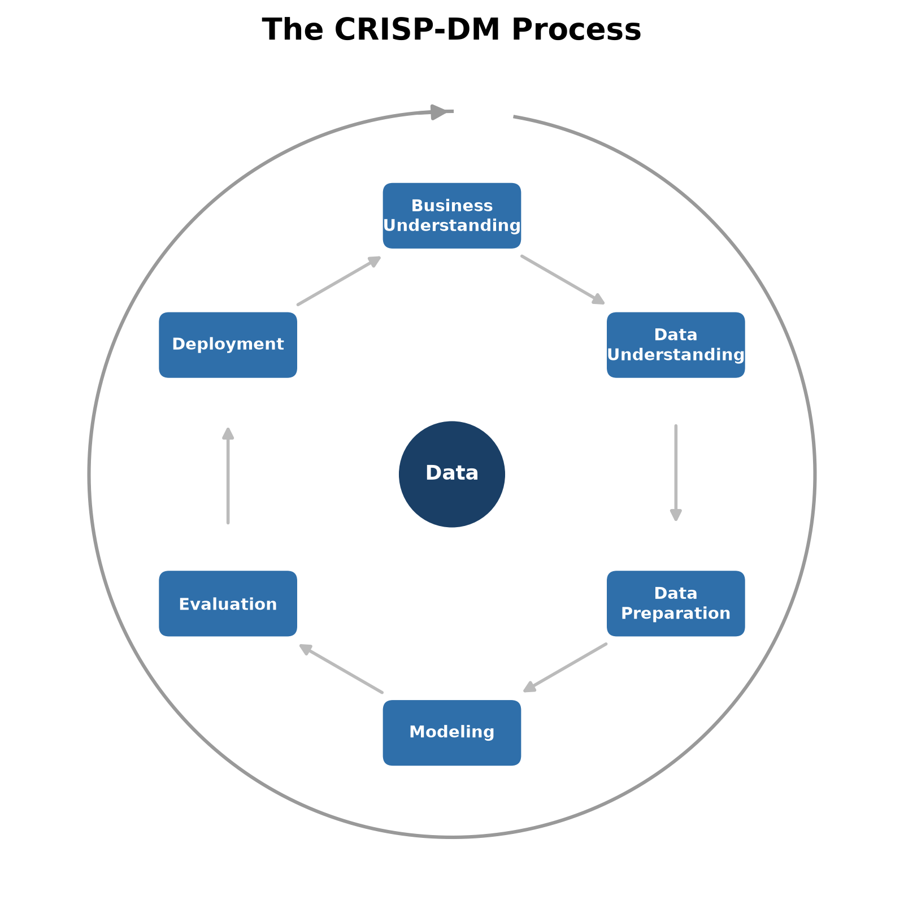

# Introduction

Analytics has taken on a pivotal role in modern society, and we rely on it on a daily basis often
without realizing it. The omnipresence of and reliance on analytics has increased sharply over the past
few years, with the introduction of large language models and generative AI into everyday products.
This book itself could even serve as a small example of that shift: like most writing and coding
today, parts of it were co-produced and polished with the help of a generative AI assistant working
with a human in the loop. The boom in LLMs and generative AI has understandably pulled artificial
intelligence into the public conversation and even the kitchen table.

But generative AI is only the most visible recent chapter of a much longer history of analytics. Long 
before ChatGPT, Gemini and Claude, data analytical models were already quietly shaping the everyday
decisions businesses make about their customers and products. When scanning your loyalty card (or
mobile app nowadays) at the supermarket, a model decides which promotional folder lands in your inbox
next. When scrolling through your social media feed, a ranking algorithm determines which posts are
most likely to keep you engaged. On streaming services a recommender system has quietly reshuffled
its entire catalogue around what it predicts you'll want to watch or listen to next. If you apply for
a loan or an insurance policy, a risk model estimates how likely you are to default or file a
claim, and a bank or insurer uses that estimate to decide whether to approve your application and at
what price. However, you might assume that the realm of analytics is limited to
business-to-consumer applications. It's not! In industrial settings, analytics is used to optimize 
production processes, reduce energy consumption, and improve product quality. On the factory floor, 
sensor data feeds predictive maintenance models that monitor when a machine is likely 
to fail before it actually does, such that preventive actions can be taken. These models also help to 
decide how many spare parts to keep in stock for (unexpected) breakdowns. On a broader supply chain 
level, demand forecasting models also assist on how much raw material to order, how to design the 
manufacturing site layout, how much inventory to hold, and how many to reorder weeks in advance.

This chapter introduces what data analytics actually is, why it has become central to business
decision-making, and how the rest of this book is organized around the process of turning raw
data into a working analytical model.

## Why data analytics now?

Three things happened at roughly the same time: the amount of data organizations collect
exploded, computing power to process it became cheap, and the algorithms to make sense of it
matured. @mortenson2015operational call this convergence the
**sixth period** in the century-long evolution of operational research and analytics (running
from the mid-2000s to today). Given the prevalence of online data sources, businesses had 
continuous access to data from customers, competitors, and the general
public via social networks. Even their own machines and products were being connected and 
continuously monitored, in the "internet of things". That data quickly outgrew traditional databases 
and business intelligence architecture, giving rise to an entire new ecosystem of technologies such 
as Hadoop, NoSQL and NewSQL databases, and cloud computing. All these systems were built specifically 
to store, process, and analyze data at scale. The
result is that analytical models now sit behind decisions that used to rely purely on human
judgment and increasingly outperform it.

A **seventh period** arguably began with the arrival of generative AI, though this is our own
extension, not part of @mortenson2015operational's original 2015 framework, which predates the
release of ChatGPT by several years. The shift from models that *describe and predict* to models
that *generate and respond* (a distinction we return to later in this chapter), and, with
agentic AI, even *act on their own*, marks as sharp a break with the analytics period as the
analytics period itself marked with what came before it.

A few examples make this concrete. In late December 2019, an AI system monitoring news reports
and airline ticketing data flagged unusual pneumonia activity in Wuhan, China, days before
public health authorities issued their own warnings. A nice illustration of how analytics
can act as an early detection system for a signal humans hadn't yet noticed. 
That signal, of course, would go on to become COVID-19, and everything else from there is history.
Around the same period, revelations about Cambridge Analytica showed how predictive models built on 
Facebook data (e.g., likes, comments, status updates, groups, etc.) could infer
personality traits and how these personality traits could be used to target voters individually. 
Progress has only accelerated since: modern large language models now routinely match or exceed 
professional-level performance on standardized exams in law and medicine, and in 2025 both OpenAI and 
Google DeepMind's reasoning models achieved a gold-medal-level score at the International 
Mathematical Olympiad, solving 5 of the 6 contest problems under official conditions. OpenAI's
result was graded by former IMO medalists; DeepMind's performance was independently verified by
official IMO coordinators.[^imo-2025] In medicine specifically, deep learning models have been shown to match or outperform
radiologists at detecting breast cancer in screening mammograms.

[^imo-2025]: ["AI Reasoning Models Achieve Gold-Medal Performance at the International Mathematical Olympiad"](https://intuitionlabs.ai/articles/ai-reasoning-math-olympiad-imo), IntuitionLabs, accessed 2026.

These capabilities cut both ways. As analytical models are given more influence over decisions
that affect people's lives (e.g., credit, hiring, medical diagnosis, criminal justice) regulators
have started drawing hard lines around how they can be used. One notable example of careless use
of AI systems was the COMPAS (Correctional Offender Management Profiling for Alternative
Sanctions) algorithm, used across the U.S. to assess a defendant's risk of recidivism for general
and violent crime. An investigation found the tool was biased against Black defendants, who were
flagged as high-risk more often despite not reoffending at a higher rate. What makes the case
genuinely instructive, though, is not just *that* the model was biased, but *why*:
@Lagioia2022 show that COMPAS was, overall, roughly equally accurate for Black and White
defendants, yet it still made one particular kind of mistake, wrongly flagging someone as
high-risk who never went on to reoffend, far more often for Black defendants. Trying to remove
that specific problem can, in turn, make a different imbalance worse elsewhere, because the two
groups didn't reoffend at the same rate to begin with. In other words, "being fair" isn't a
single, clear-cut target a data scientist can just optimize for: different, equally reasonable
ideas of what counts as fair can pull in different directions, so choosing between them ends up
being as much a value judgment as a technical one.

The EU has responded to cases like this in stages. GDPR
[@http://data.europa.eu/eli/reg/2016/679/oj], which became enforceable in 2018, was a first
step. It doesn't target AI specifically, but it sets out several key principles for processing
personal data (among them fairness, purpose limitation, and data minimisation) together with a
right to meaningful information about automated decisions made about you. We'll come back to
these principles in more detail later in this book, once we start working with real personal
data ourselves. The EU AI Act [@http://data.europa.eu/eli/reg/2024/1689/oj] builds on that
foundation with a comprehensive, risk-based framework specifically for AI systems: it classifies
applications into risk tiers, from "unacceptable" (e.g., real-time biometric scoring for social
credit purposes) down to "minimal" (e.g., spam filters), with correspondingly stricter
requirements for higher risks (e.g., high-stakes criminal-justice risk scoring like COMPAS).

{#fig-ai-risk fig-alt="The EU AI Act risk pyramid, 
showing four tiers from top to bottom: Unacceptable Risk, High Risk, Limited Risk (AI systems with 
specific transparency obligations), and Minimal Risk."}

In sum, data analytics is no longer a specialized department that runs in the back-office. It shapes what
products get built, what prices get charged, who gets a loan, and increasingly, what rules
govern all of the above, which is exactly why it is crucial to business and economics.

## What is data analytics?

In essence, **data analytics is about transforming raw data into actionable insights for
business**. It does so by applying descriptive, diagnostic, predictive, and prescriptive models
to heterogeneous, and often large, data sources, so that organizations can make quicker,
better, and more intelligent decisions that create business value.

Business analytics sits at the intersection of several disciplines: operations research,
information systems, and machine learning all contribute methods. However, domain knowledge and
understanding of the actual business problem determine whether those methods produce
anything useful for business [@mortenson2015operational; @hindle2020business]. That combination is exactly
what makes it a natural fit for business and economics students: your training gives you the
technical grounding, and your business and economic mindset gives you the domain framing to point that
technique at a problem worth solving.

.](../images/ch01-fig-analytics-intersection.jpg){#fig-analytics-intersection fig-alt="Venn diagram showing Analytics at the center of three overlapping circles: Technologies (Electrical Engineering, Computer Science), Decision Making (Psychology, Behavioural Science), and Quantitative Methods (Mathematics, Statistics, Economics/Econometrics), with pairwise overlaps labeled Information Systems, Artificial Intelligence (Machine Learning), and Operational Research."}

A long list of near-synonyms for this field has been used throughout the years (mainly depending on the
hype of that moment): artificial intelligence (AI), big data, machine learning, data mining, data
science, deep learning, and in the old days, knowledge discovery, pattern recognition. In practice, these 
terms overlap heavily and are often used interchangeably, though later in this chapter we'll draw out a 
few real distinctions (particularly between AI, machine learning and statistics) that matter once you 
start building models yourself.

### The four types of analytics

Data analytics is usually broken down into four types, distinguished by the kind of question
they answer:

- **Descriptive analytics** describes historical trends or *what* happened. Reporting dashboards,
  business intelligence tools, and services like Google Analytics are almost entirely
  descriptive.
- **Diagnostic analytics** explains *why* something happened, digging into the causes behind a
  trend that descriptive analytics only shows you.
- **Predictive analytics** estimates what *will* happen in the future, based on patterns in historical data.
- **Prescriptive analytics** recommends the best next *action* or decision to take, given a predicted outcome.

Let's consider a simple example to make the distinction more concrete. Imagine tracking a product's yearly
sales. Descriptive analytics plots the historical sales curve. Diagnostic analytics explains why
sales dropped two years ago (a competitor launched a similar, cheaper product). Predictive
analytics forecasts that, on the current trajectory, sales will keep declining next year.
Prescriptive analytics recommends a concrete intervention (e.g., a price adjustment or a product
redesign) to reverse that trend.

{#fig-analytics-types fig-alt="Three stacked line charts sharing the same two series (blue and grey) across time points t-15 through t or t+1. Top panel, titled 'Descriptive analytics describes the historic trends', ends at t. Middle panel, titled 'Predictive analytics estimates the future trend', extends both series one period further to t+1, continuing their decline. Bottom panel, titled 'Prescriptive analytics tries to reverse this trend', is identical except the grey series ticks upward at t+1 instead of continuing to decline."}

A slightly more elaborate version of the same idea: a B2C e-commerce platform wants to optimize
its pricing strategy. Descriptive analytics tells it how prices and sales have historically
moved together. Diagnostic analytics uncovers why prices had an impact on sales in the past (e.g., perhaps
a past price cut drove a spike in demand). Predictive analytics forecasts how a proposed price change
would affect future sales.
Prescriptive analytics goes one step further and recommends the actual pricing strategy 
(e.g., dynamic pricing, product bundling) that maximizes profit given that forecast.

These four types are also hierarchical in complexity and organizational maturity: most
organizations start with descriptive analytics, move into predictive analytics as their data and
modeling capabilities mature, and only later exploit prescriptive analytics: the analytics
equivalent of asking not just "what will happen," but "what should I do about it,"
using optimization, simulation, and decision modeling techniques [@delen2018research]. In
practice the boundaries blur: an organization can be firmly in descriptive-analytics territory
for most of its reporting while already piloting predictive models in one specific area.

{#fig-taxonomy fig-alt="A curve rising from bottom-left to top-right, with four points marked along it: Descriptive ('What happened?'), Diagnostic ('Why did it happen?'), Predictive ('What will happen?'), and Prescriptive ('What should we do?'), showing both computational sophistication and business value increasing together."}

### AI, machine learning, and data analytics

These three terms are related but not identical:

- **Artificial intelligence (AI)** is the broad field of computer science dedicated to solving
  problems that would otherwise require human intelligence.
- **Machine learning** is a subfield of AI: the study of algorithms that build a mathematical
  model from sample (training) data in order to make predictions or decisions, without being
  explicitly programmed for the task. Much like a person improves at an instrument through
  repeated practice, a machine learning model improves its predictions as it's given more
  training data.
- **Data analytics** uses big data and mathematical models (often, but not exclusively, machine
  learning models) to explain or predict a business outcome and support (and preferably improve) decision-making.

Within that space, **predictive analytics** deserves a closer look, since much of this book is
about building predictive models. It has been defined as "the process by which a model is
created or chosen to try to best predict the probability of an outcome" [@geisser1993predictive]
and, more generally, as "the process of developing a mathematical model that generates an accurate
prediction" [@kuhn2013applied]. In recent years predictive analytics, data mining, and machine
learning have been used almost interchangeably, but if you want a precise distinction: predictive
analytics is about predicting the *future*, while machine learning is about predicting *unseen
data* more generally (which is often, but not always, in the future). Under that reading,
predictive analytics is a subfield of machine learning, even though the underlying algorithms
are frequently identical; only the setup differs.

### Machine learning vs. statistics

It's tempting to think that you don't need to know statistics to do machine learning. That's
not quite right, since machine learning builds on statistical foundations. The difference between them
matters for how you'll approach modeling problems throughout this book.

- **Machine learning** is interested in maximizing prediction accuracy (or, equivalently,
  minimizing error) on unseen data. It is generally *not* interested in explaining *why*
  something happens. Although interpretable machine learning is an active research area [@DeBock2024], the
  objective function being optimized is still accuracy.
- **Statistics**, by contrast, is often more concerned with the *explanatory power* of a model:
  how do the independent variables influence the dependent variable, and by how much? This goal is
  *causal analysis* rather than pure prediction.

This distinction between prediction and causal analysis has practical consequences for how you
build and evaluate a model. Take customer churn as a running example: a bank might build a model
to *predict* which customers are about to leave, or a model to *explain* what actually *causes* 
customers to leave in the first place. Same data, sometimes even the same techniques, but the goal
changes what you should worry about, along at least three dimensions:

1. **Omitted variables.** If you're *explaining* churn, leaving out a variable that both drives
   churn and correlates with a variable already in your model will distort your other
   coefficients. For example, you might conclude that high monthly charges cause churn, when really both are driven by something you failed to include, like contract type. If you're *predicting* churn,
   that same omission only matters if adding the missing variable would have made your predictions
   more accurate. A distorted coefficient is irrelevant if you were never trying to isolate one
   variable's true effect to begin with.
2. **Accuracy.** A *causal* churn model can have fairly low explanatory power and still be useful. Even 
  if it only accounts for a small share of the variation in churn, you can still say with
   confidence that a specific driver (e.g., a recent price change) has a genuine effect,
   especially with a large enough sample. A *predictive* churn model doesn't get that amount of slack: if
   it can't accurately flag which customers are actually about to leave, it's useless for
   prioritizing retention offers, no matter how large the training data was.
3. **Multicollinearity.** Suppose tenure and number of products owned are highly correlated
   across your customers. For a *causal* model, that's a real problem since it becomes hard to say how
   much of the churn effect is really due to tenure vs product count, because the two are so intertwined. For a *predictive* model, that ambiguity barely matters: as long as the correlated
   variables jointly improve how well you flag at-risk customers, you don't need to cleanly
   separate out each one's individual contribution. We'll return to multicollinearity once we dive into data preprocessing later in this book.

### Big data and generative AI

Two developments are worth calling out explicitly, since they shape almost everything else in
this field.

**Big data** is usually characterized by four Vs: **volume** (the total amount of data),
**velocity** (how fast the data is generated and needs to be processed), **variety** (how many
different forms the data takes, like structured, text, image, or network data), and **veracity** (how
uncertain or noisy the data is, especially when it comes from many different, unchecked sources). In
this book, we propose adding a fifth V: **value**. We see this as one of the core Vs rather than an 
optional add-on: data that doesn't create value for a business, in any of its processes, simply isn't
worth collecting, storing, or analyzing in the first place. Extracting that value is arguably the
point of this entire book. Most routine business activity now generates data that can be stored,
visualized, and analyzed, and as storage and compute keep getting cheaper, previously
uneconomical analyses now become viable and create value.

{#fig-bigdata fig-alt="Five core elements arranged around the concepts of 'Big Data': Volume (amount), Velocity (speed), Variety (forms), Veracity (uncertainty), and Value (impact), with Value added as a distinct element."}

**Generative AI** has pushed analytics from *describing and predicting* into *responding and
creating*. Generative models produce text, images, audio, or video from a user-supplied prompt,
after being trained on very large amounts of data. Whereas these models can respond by supplying
the prompt without any training data, under the hood they're still built on a
predictive learning task: a large language model is, at its core, repeatedly predicting "given
this context, what's the most likely next word?"; an image diffusion model is repeatedly
predicting "given this noisy image, what does a slightly less noisy version look like?" In this
book, you should use LLMs as a *learning aid*. For example, as a way to generate extra
practice exercises once you already understand the underlying concept. Don't use them as a
substitute for understanding the material yourself, since a tool that merely reproduces patterns
it has seen before is a poor foundation on its own.

### What makes a good analytical model

Not every model that achieves good accuracy on a test set is actually a *good* model for the
business. Five requirements tend to come up again and again [@Baesens2014]:

- **Relevance.** Does the model actually solve the business problem it was built for? A telecom's
  data science team might build a churn model that flags customers at-risk six months before they
  leave only to discover the retention budget can only fund targeting customers in their final 30 days. The model is accurate but irrelevant, because nobody agreed on the decision it actually needed to support before anyone started
  building it.
- **Performance.** Does the model generalize well to new, unseen cases and not just the data it was
  trained on? A credit-scoring model might reach 95% accuracy on the applicants it was trained on,
  and then barely beat a coin flip on next month's applicants. This concept is called *overfitting*: the model memorized its training data instead of learning a pattern that actually holds up. What "good performance" means varies by problem type (discrimination power for classification, cluster homogeneity for clustering). We'll cover the relevant metrics in the chapter on model evaluation.
- **Interpretability and justifiability.** Interpretability means you can understand the patterns
  the model has captured; justifiability means those patterns are consistent with prior business
  knowledge and intuition [@martens2011performance]. Amazon famously scrapped an internal AI
  recruiting tool after discovering it had taught itself to downgrade résumés containing words
  like "women's" (e.g., "women's chess club captain"). This is a pattern that helped predict who'd
  historically been hired, but one no HR department could ever justify using for obvious reasons.[^amazon-hiring] High-performing models (e.g., neural networks) are often black boxes; simpler, transparent models trade some performance for interpretability, and how much that trade-off matters depends on the setting. For example, hiring and credit decisions usually demand interpretable models, while a spam filter can happily stay a black box. However, thorough feature engineering and careful model evaluation can often produce interpretable models that are almost as accurate as black-box alternatives, so the trade-off isn't always inevitable.
- **Operational efficiency.** How much effort does it take to collect the data, prepare it,
  evaluate the model, put it into production and afterward, to monitor it, backtest it, and
  re-estimate it as conditions change? For example, a fraud-detection model that takes three days to score a transaction is worthless no matter how accurate it is, since the decision to approve or block a
  payment has to happen in milliseconds.
- **Regulatory compliance.** Especially for models using personal or sensitive data, does the
  model comply with data protection and AI regulation, like GDPR, the EU AI Act, or
  sector-specific rules? For example, a lending model that never uses race as an input
  can still be found discriminatory if it leans heavily on a variable like zip code that
  correlates strongly with it. In sum, following the letter of the law isn't enough if the outcome still
  discriminates in practice.

[^amazon-hiring]: Dastin, J. (2018). ["Amazon scraps secret AI recruiting tool that showed bias against women."](https://www.reuters.com/article/world/insight-amazon-scraps-secret-ai-recruiting-tool-that-showed-bias-against-women-idUSKCN1MK08G/) Reuters, October 10, 2018.

### Data

#### Terminology and structure

Before working with data hands-on in the next chapters, it helps to fix some vocabulary about a data set, terms you'll see used more or less interchangeably throughout this book and elsewhere:

- **Independent variables**: also called features, predictors, inputs, attributes, or
  descriptors. These are the variables you use to predict something.
- **Dependent variable**: also called the target, outcome, output, response, or (in
  classification) the label or class. This is the thing you're trying to predict.
- **Data point**: a single observation, instance, or record.
- **Modeling**: also called model building, or training.
- **Prediction**: also called estimation, or inference.

Data itself comes in a few standard shapes:

- **Cross-sectional data** captures many units at a single point in time: one row per
  observation, useful for estimating a model that applies at "this moment."
- **Time series data** tracks a single variable over time at regular intervals: rainfall, stock
  prices, sales, energy prices.
- **Panel data** (also called longitudinal data) combines both: repeated observations of the same
  units (households, products, firms) across repeated time periods.

Regardless of which of these shapes your data takes, how you *arrange* it also matters. **Tidy
data** [@wickham2014tidy] is the standard way to structure a dataset so that later analysis (descriptive 
statistics, visualizations, further processing) is easy: each variable forms a
column, each observation forms a row, and each type of observational unit forms its own table. A
"messy" table with one column per store and one row per year, versus a "tidy" table with one row
per store-year combination, contains the same information, but only one of them is easy to
filter, aggregate, and model. We'll come back to tidying data concretely once we start working
with `pandas`.

Be aware that not all data is tabular. Text, images, audio, and networks are increasingly common
data sources, and they require dedicated modeling approaches, though generative AI has made working
with some of them (especially text and images) far more approachable than it used to be. This book
focuses on tabular data, since it remains the form business and economics students encounter most,
but the same tidying and preparation mindset carries over once you move to other data types. And no
dataset, tabular or not, arrives clean: missing values, outliers, and messy relationships between
variables are the norm, which is exactly why data preparation and preprocessing gets its own chapter
later in this book.

#### Data samples are always biased

Every data sample you work with is biased in some way, and it's worth internalizing this before you
trust a model's output. The classic illustration in this case is **survivorship bias**. In WWII engineers
were studying where returning bomber aircrafts had been hit in order to know where to add armor. The
natural instinct is to reinforce the areas with the most bullet holes. However, those planes *made it
back*! The planes that didn't survive were hit somewhere else entirely, and that data was never
collected. The correct conclusion was the opposite of the intuitive one: reinforce the spots with
*no* damage on the survivors, since those are the hits that bring a plane down.

.](../images/ch01-fig-survivorship-bias.png){#fig-survivorship fig-alt="A World War II bomber aircraft seen from above, covered in red dots marking a hypothetical hit pattern concentrated on the wings, tail, and fuselage, with the engines and cockpit conspicuously free of dots."}

The business analogy is straightforward. If you build a model of "what makes a store successful" using
only data from your current top-performing stores, you'll miss out on the factors that
made other locations fail and your conclusions will be biased toward the survivors. Because any sample is collected at a particular point in time, under a particular strategy and
economic climate, it's worth asking not just "is this sample biased," but "biased in what way, and
does that bias matter for the decision I'm about to make?" For example, a model trained on pre-COVID-19 retail data might be biased toward in-store shopping behavior, and a model trained on 2020-2021 data might be biased toward online shopping behavior. If you use either of those models to make decisions about the post-pandemic retail landscape, you'll likely make mistakes.

### Supervised and unsupervised learning

Machine learning methods are split into two broad families, depending on whether you have a
dependent variable to predict.

**Supervised learning** aims to approximate reality with a function: given inputs, infer a
reliable pattern that maps them onto a known output. This inferred function is designed in a way that 
generalizes to new, unseen cases. This requires a response variable, and splits further by the type of that response:

- **Classification**, for a categorical or discrete response (binary, multiclass,
  multilabel, or ordinal).
- **Regression**, for a continuous or numerical response (predicting either an absolute value
  or a change (delta) in value).

Supervised models are also commonly grouped by how they represent the underlying relationship:

- **Parametric models** first assume a functional form for the relationship (e.g., linear), then
  estimate a fixed number of parameters for that form. This is much easier to estimate, but
  performs poorly if the assumed functional form doesn't match reality.
- **Nonparametric models** make no such assumption and let the data determine the shape of the
  relationship. This is far more flexible and can be more accurate, but typically needs
  substantially more data. The danger is that it can end up fitting noise rather than signal ("too accurate" on the training data, at the expense of generalization on the test data).

**Unsupervised learning** has no dependent variable, only independent variables, and is
correspondingly more subjective to evaluate. Its goals include:

- **Clustering**: finding homogeneous subgroups in the data.
- **Dimensionality reduction**: compressing many variables down to two or three for
  visualization.
- **Association rule mining**: finding "if antecedent, then consequent" rules that describe
  co-occurring patterns (e.g., market basket analysis).
- **Anomaly detection**: finding outliers or anomalies that don't fit the rest of the data.

## The data analytics process: CRISP-DM

Producing a reliable, robust analytical model isn't something you improvise: practitioners
follow a fixed framework that lets a project be carefully defined, organized, and structured.
The two best-known frameworks are KDD or Knowledge Discovery in Databases [@fayyad1996from] and, more widely used
today, **CRISP-DM** or the Cross-Industry Standard Process for Data Mining
[@chapman2000crisp].

{#fig-crispdm fig-alt="A circular diagram with six boxes (Business Understanding, Data Understanding, Data Preparation, Modeling, Evaluation, and Deployment) arranged around a central 'Data' hub, connected by arrows showing the typical sequence between adjacent phases, with an outer arrow looping from Deployment back to Business Understanding."}

CRISP-DM organizes an analytics project into six phases:

1. **Business understanding**: determine the business objectives and translate them into data
   mining goals.
2. **Data understanding**: describe and explore the available data, and identify data quality
   issues.
3. **Data preparation**: select, clean, construct, aggregate, and integrate data into a single
   basetable containing every variable you'll model with.
4. **Modeling**: set up a proper test design, select an appropriate modeling technique, and
   build and interpret the model.
5. **Evaluation**: evaluate the model using appropriate performance metrics.
6. **Deployment**: put the model into production.

CRISP-DM is considered the gold standard process because it's well documented, widely adopted,
and more clearly organized than competing processes. Two things are worth knowing before you
start your own first project. First, data understanding and preparation are consistently the most
time-consuming steps: often cited as taking up to 80% of total project time! Second, the process
is *iterative*, not linear. You will regularly find yourself going back a step (or several) once
something you learn in modeling changes what you thought you understood about the data.

This same six-phase structure maps directly onto how the rest of this book is organized: the
coming chapters on data understanding, data preparation, model evaluation, and modeling each
correspond to one phase of CRISP-DM, applied in a business setting.

## Where data analytics shows up

Data analytics is genuinely everywhere in modern business, not just in the usual tech companies, and well
beyond the handful of examples already mentioned in this chapter's opening. A streaming
platform's next-series recommendations, the dynamically adjusted fare prices on a ride-hailing app, a
spam filter quietly sorting your inbox, an automatic reorder triggered the moment a warehouse's
stock dips below a threshold, a warning signal when the condition of an industrial asset deteriorates: 
all of these are analytics applications running in the background of ordinary business operations.

More systematically, applications span nearly every business function:

| Marketing | Finance | Manufacturing & Operations | Supply Chain & Logistics | Public Sector | Digital & Other |
|---|---|---|---|---|---|
| Response and uplift modeling | Credit scoring | Predictive maintenance | Demand forecasting | Tax fraud detection | Web and social media analytics |
| Customer churn | Fraud detection | Condition monitoring | Route and network optimization | Social benefit fraud detection | A/B and multivariate testing |
| Customer segmentation | Market risk modeling | Spare-parts inventory optimization | Warehouse and inventory management | Money laundering detection | Misinformation and rumor detection |
| Market basket analysis | Operational risk modeling | Personnel and shift scheduling | | Security and terrorism risk detection | Hospitality and tourism analytics|
| Recommender systems | | Quality control and defect detection | | | HR analytics |
| | | | | | Healthcare analytics |
| | | | | | Learning analytics |

Two applications are worth walking through in a bit more detail, since they recur throughout this
book.

**Customer churn prediction.** Analytical customer relationship management (CRM) uses modeling
techniques on customer characteristics and behavior to support cost-effective, targeted marketing
for acquisition modeling, up-sell and cross-sell modeling, customer lifetime value estimation, and
churn modeling. Churn, defined as the loss of a customer, matters because acquiring a new customer
typically costs five to six times more than retaining an existing one [@Bhattacharya1998], and 
established customers tend to be more profitable and more likely to refer others [@VandenPoel2004]. Churn 
prediction models assign each customer an individual propensity to churn, so the company can proactively 
target the highest-risk customers with a retention offer *before* they leave, rather than reactively after
the fact. Useful features typically include demographic variables, relationship variables
(tenure, number of products), and RFM variables (Recency, Frequency, and Monetary value) of past
purchases. Because comprehensibility lets business experts sanity-check a churn model and
understand what's actually driving churn, logistic regression is often treated as the gold
standard here: easy to interpret, reasonably accurate, and well understood in both research and
practice.

**Credit risk modeling.** Credit scoring is concerned with assessing financial risk and informing
lending decisions: a credit score is a model-based estimate of the probability that a borrower
will default and fail to meet their financial obligations [@Lessmann2015]. Consumer loans and mortgages often exceed corporate lending in total volume at the country level, which is exactly why credit scoring
has been called "one of the most successful applications of statistics and OR in industry"
[@Crook2007]. It's also one of the most mature and heavily benchmarked applications of predictive
analytics in business. Despite a steady stream of more complex algorithms, logistic regression has 
remained a surprisingly hard baseline to beat in practice [@Lessmann2015]. There are two main types of 
credit scoring models: application scorecards and behavioral scorecards. *Application scorecards* score 
new credit applications for creditworthiness, typically built from two snapshots; application data and 
credit bureau data. Both snapshots are taken at loan origination and matched against whether the applicant
actually defaulted 12 or 18 months later. *Behavioral scorecards* go further, scoring the existing 
customer portfolio using both application data and behavioral trends (account balance movement, 
delinquency history, credit limit changes), and tend to outperform application scorecards since they have 
more (and more current) information to work with.

## Why Python

The data, AI, analytics, and machine learning tooling landscape is enormous, ranging from off-the-shelf
business-intelligence (BI) tools optimized for point-and-click visual analysis on one end, to full
programming languages on the other. As a business student, you'll mostly work with the
programming-language end of that spectrum, since it's what gives you the flexibility to go beyond
what an off-the-shelf BI tool can do.

Among programming languages, Python and R have long been the two dominant choices for data
science, but Python has clearly emerged as the winner in recent years when measured by job postings,
community size, and package ecosystem maturity. Python wasn't originally designed as a data science
language, but it became the standard one for several reasons: 

- its syntax is logical and comparatively easy to learn;
- it's genuinely general-purpose, useful for everything from short scripts to full enterprise 
applications; 
- its ecosystem includes a handful of foundational packages this book relies on directly (`numpy`, 
`pandas`, `matplotlib`, `scikit-learn`, among others); 
- and it has an enormous community across Stack Overflow, GitHub, and beyond, so help is
rarely far away.

One more note before you start writing Python yourself: large language models (LLMs) are useful
coding *assistants* for debugging, for explaining unfamiliar code, for generating extra
practice exercises, but they are not a substitute for understanding the fundamentals. An LLM
doesn't reason about your code from first principles; it produces output based on patterns it has
seen before, and that output is often subtly wrong. The proper order is to learn the basics
and write the code yourself first, and use an LLM to accelerate that process second and not the
other way around.

## How this book is organized

The chapters that follow mirror the CRISP-DM process introduced above, applied consistently to a
single running business case so techniques build on each other instead of feeling like
disconnected exercises:

- **Python for Data Analytics**: the Python fundamentals used throughout the rest of the
  book.
- **Data Understanding**: manipulating and making sense of raw datasets.
- **Data Exploration**: visualizing data to find patterns, relationships, and quality issues. In CRISP-DM terms, this is part of the data understanding phase, but we separate it out because it's a
  distinct skill set that deserves its own chapter.
- **Data Preparation**: cleaning and transforming data so it's ready for modeling.
- **Model Evaluation**: how to set up a fair experiment and measure whether a model is any good,
  *before* worrying about which model to use.
- **Modeling**: building and interpreting linear and logistic regression models.

If you're setting up Python and an IDE for the first time, see the installation guide in the
appendix.
