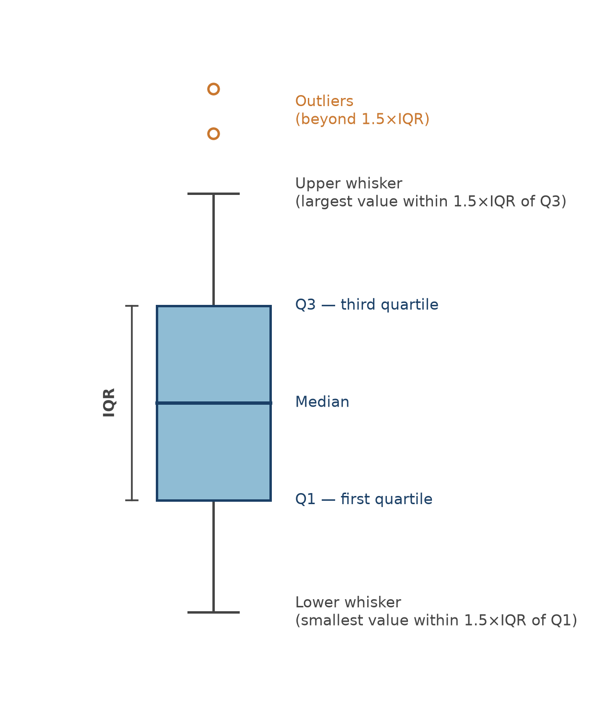

# Data Exploration

The previous chapter discussed the **variable level** of data understanding: once you know
which tables you have and what type each column is, the next question is what each variable
actually *looks like*, and whether it has quality issues you'll need to deal with before you can
trust a model built on it. That's what this chapter covers: visualizing individual variables to
spot patterns, and detecting and treating the most common data quality issues: multicollinearity, missing values, and outliers.

We'll continue with NPC's customers and subscriptions tables from the previous chapter.

## Why visualize

Summary statistics alone can be dangerously misleading. **Anscombe's quartet**
[@anscombe1973graphs] is the classic illustration: four small datasets that share the same mean,
variance, and correlation for `x` and `y` and yet look completely different when plotted. One
is a clean linear relationship, one is a clear curve with a straight line fits poorly due to an outlier, 
one is a vertical line of points plus one outlier.
`.describe()` can't tell these apart. A scatter plot can immediatly visualizes the differences. That's 
the whole point of visual exploration: it shows patterns, outliers, and relationships that summary 
statistics alone can hide.

```{python}
#| echo: false
import matplotlib.pyplot as plt
import pandas as pd
import numpy as np

anscombe = pd.DataFrame({
    "dataset": ["I"] * 11 + ["II"] * 11 + ["III"] * 11 + ["IV"] * 11,
    "x": [10, 8, 13, 9, 11, 14, 6, 4, 12, 7, 5] * 3
         + [8, 8, 8, 8, 8, 8, 8, 19, 8, 8, 8],
    "y": [8.04, 6.95, 7.58, 8.81, 8.33, 9.96, 7.24, 4.26, 10.84, 4.82, 5.68,
          9.14, 8.14, 8.74, 8.77, 9.26, 8.10, 6.13, 3.10, 9.13, 7.26, 4.74,
          7.46, 6.77, 12.74, 7.11, 7.81, 8.84, 6.08, 5.39, 8.15, 6.42, 5.73,
          6.58, 5.76, 7.71, 8.84, 8.47, 7.04, 5.25, 12.50, 5.56, 7.91, 6.89],
})

# Check whether the four datasets really do share the same summary statistics
summary = anscombe.groupby("dataset").agg(
    mean_x=("x", "mean"), mean_y=("y", "mean"),
    std_x=("x", "std"), std_y=("y", "std"),
    corr=("x", lambda s: s.corr(anscombe.loc[s.index, "y"])),
)
summary.round(2)
```

```{python}
#| echo: false
fig, axes = plt.subplots(2, 2, figsize=(10, 8), sharex=True, sharey=True)

for ax, (name, group) in zip(axes.flat, anscombe.groupby("dataset")):
    ax.scatter(group["x"], group["y"], color="#2f6faa")
    coeffs = np.polyfit(group["x"], group["y"], 1)
    x_line = np.linspace(group["x"].min(), group["x"].max(), 50)
    ax.plot(x_line, np.polyval(coeffs, x_line), color="#c9772e", linewidth=1.5)
    ax.set_title(f"Dataset {name}")

fig.suptitle("Anscombe's Quartet: identical statistics, very different data", fontsize=13)
plt.tight_layout()
plt.show()
```


It's worth being clear about what kind of visualization this chapter is about. Visualization
serves two different purposes:

- **Explore**: you're the analyst, and the goal is discovering insights in the data as fast as
  possible. Speed and discovery matter more than polish.
- **Explain**: someone else is the audience, and the goal is communicating a specific finding or message
  clearly. It is also more about creating a compelling narrative and conveying your message in the proper
  way.

This chapter is entirely about the first one. The charts you'll build here are working tools, not fancy
presentation slides.

The charts covered in this chapter are what you need for exploration, but they're a small
fraction of what's out there. For examlpe, treemaps, Sankey diagrams, spatial maps, slope charts, and
dozens of others each have situations where they're the right option. Once your goal shifts from
*exploring* to *explaining* the chart itself is only 
half the job; the other half is design choices (how to remove clutter, where the attention should go, what to cut) that turn a chart into a story. That's a large enough topic that it deserves books of its
own. Two excellent reading materials, if you want to go deeper: Cole Nussbaumer
Knaflic's [*Storytelling with Data*](https://www.storytellingwithdata.com/) and Brent Dykes's
[*Effective Data Storytelling*](https://www.effectivedatastorytelling.com/).

### Matplotlib basics

Python's core plotting library is `matplotlib`. Almost everything in `matplotlib` follows the
same three-part structure:

- A **figure** is the overall canvas.
- One or more **axes** are the actual plotting areas inside that pane (confusingly, one "axes"
  is a single plot, not an axis line).
- An **artist** is everything else you can see (e.g., lines, text, bars, points) .

In practice, you'll almost always start a plot the same way: create a figure and axes together
with `plt.subplots()`, draw onto the axes using a specific chart type, then label it.

```{python}
import matplotlib.pyplot as plt

x = [1, 2, 3, 4, 5, 6, 7, 8, 9, 10]
y = [10, 20, 25, 30, 35, 40, 45, 50, 55, 60]

fig, ax = plt.subplots()
ax.scatter(x, y, label="Example", color="blue", marker="o")

ax.set_title("Simple Scatter Plot")
ax.set_xlabel("X-axis")
ax.set_ylabel("Y-axis")
ax.legend()

plt.show()
```

We'll also use `seaborn`, a library built on top of `matplotlib` that trades some of its
flexibility for far more concise syntax and better default styling, especially for statistical
plots like regression lines, heatmaps, and pair plots.

## The core chart types

There are dozens of chart types, but for data exploration a small toolkit covers almost
everything: **bar charts**, **line charts**, **scatter plots**, **histograms**, and **box
plots**.

To demonstrate these, we will load the NPC data we saved at the end of the previous chapter.

```{python}
import pandas as pd
import numpy as np
import seaborn as sns

subscriptions = pd.read_parquet("../data/raw/subscriptions.parquet")
customers = pd.read_parquet("../data/raw/customers.parquet")
```


### Comparing groups: bar charts

A bar chart represents each category's value or frequency as a vertical or horizontal rectangular bar and 
is useful whenever you want to compare discrete categories against each other.

```{python}
fig, ax = plt.subplots(figsize=(8, 6))

payment_counts = subscriptions["PaymentStatus"].value_counts()
ax.bar(payment_counts.index, payment_counts.values, color="lightblue")

ax.set_title("Payment Status Frequency")
ax.set_xlabel("Payment Status")
ax.set_ylabel("Count")

plt.tight_layout()
plt.show()
```

Whereas a vertical bar chart is often the default, a horizontal one, with the counts written directly on 
the bars, is often easier to read once category labels get long:

```{python}
fig, ax = plt.subplots(figsize=(10, 6))

payment_counts = subscriptions["PaymentStatus"].value_counts(ascending=True)
bars = ax.barh(payment_counts.index, payment_counts.values, color="lightblue")

for bar, value in zip(bars, payment_counts.values):
    ax.text(bar.get_width() + 5, bar.get_y() + bar.get_height() / 2,
            str(value), ha="left", va="center")

ax.set_title("Payment Status Distribution")
ax.set_xlabel("Frequency")
ax.set_ylabel("Payment Status")

plt.tight_layout()
plt.show()
```

::: {.callout-tip}
## Bar chart ground rules

Always plot bars against a zero baseline. Starting the axis somewhere else exaggerates
differences and misleads the reader, even if you didn't mean to. And be cautious with pie and donut
charts as an alternative: humans are much better at comparing bar *length* than comparing angles
or areas, so a bar chart usually communicates the same information more clearly.
:::

A **lollipop chart**, a thin line plus a single dot instead of a full bar, communicates the
same comparison with noticeably less visual noise. With a fraction of the ink of a bar chart, it's
often easier for the eye (and brain) to parse (lower noise-to-ink ratio), since there's less shape to take in per category:

```{python}
fig, ax = plt.subplots(figsize=(10, 6))

ax.hlines(y=range(len(payment_counts)), xmin=0, xmax=payment_counts.values,
          color="lightblue", linewidth=3)
ax.scatter(payment_counts.values, range(len(payment_counts)), color="blue", s=100, zorder=3)

ax.set_yticks(range(len(payment_counts)))
ax.set_yticklabels(payment_counts.index)
ax.set_ylim(-0.5, len(payment_counts) - 0.5)
ax.set_title("Payment Status Distribution: Lollipop Chart")
ax.set_xlabel("Count")
ax.spines["top"].set_visible(False)
ax.spines["right"].set_visible(False)

plt.tight_layout()
plt.show()
```

### Showing a trend: line charts

A line chart connects data points to show how a variable changes across an ordered sequence,
almost always time but not necessarily.

To show that a line chart can be used to visualize any ordere series, let's look at a simple example.Plotting `TotalPrice`'s sorted values 
against their rank position isn't a true time series, but it's a quick way to see the overall shape of a distribution and spot
outliers at either end:

```{python}
fig, ax = plt.subplots(figsize=(10, 6))

sorted_prices = np.sort(subscriptions["TotalPrice"].dropna())
ax.plot(range(len(sorted_prices)), sorted_prices, color="blue", linewidth=1)

ax.set_title("Sorted Total Price")
ax.set_xlabel("Index")
ax.set_ylabel("Total Price")
plt.show()
```

For an actual time series, plot against real dates. Here's the average subscription price by
month:

```{python}
subscriptions_monthly = subscriptions.copy()
subscriptions_monthly["StartDate"] = pd.to_datetime(subscriptions_monthly["StartDate"])
subscriptions_monthly["YearMonth"] = subscriptions_monthly["StartDate"].dt.to_period("M")

monthly_avg = subscriptions_monthly.groupby("YearMonth")["TotalPrice"].mean()

fig, ax = plt.subplots(figsize=(12, 6))
ax.plot(monthly_avg.index.astype(str), monthly_avg.values, color="blue", linewidth=2, marker="o")
ax.set_title("Average Total Price by Month")
ax.set_xlabel("Month")
ax.set_ylabel("Average Total Price")

plt.xticks(rotation=45)
plt.tight_layout()
plt.show()
```

A couple of practical rules of thumb: pick a measurement interval that's neither so long you
lose the trend nor so short the chart is dominated by noise. Also, avoid cramming more than about
5–7 lines onto one chart. If you have more than that, split it into several smaller charts instead.

### Showing relationships: scatter plots

A scatter plot places one point per observation on two numeric axes, making it easy to spot
correlations, clusters, and outliers between two variables at once.

```{python}
fig, ax = plt.subplots(figsize=(10, 6))
ax.scatter(subscriptions["NbrNewspapers"], subscriptions["TotalPrice"], alpha=0.6, color="blue")

ax.set_title("Number of Newspapers vs Total Price")
ax.set_xlabel("Number of Newspapers")
ax.set_ylabel("Total Price")
plt.show()
```

Adding a trend line makes the relationship easier to read at a glance. This is where `seaborn`
starts to pay off against plain `matplotlib`. `sns.regplot()` draws the scatter plot and fits a line in one call:

```{python}
fig, ax = plt.subplots(figsize=(10, 6))
sns.regplot(data=subscriptions, x="NbrNewspapers", y="TotalPrice", ax=ax)
ax.set_title("Number of Newspapers vs Total Price (with Linear Regression)")
plt.show()
```

If the relationship isn't linear, a **LOESS** (locally estimated scatterplot smoothing) curve, a
nonparametric fit built from many small local regressions, can reveal a nonlinear trend a
straight line would miss:

```{python}
fig, ax = plt.subplots(figsize=(10, 6))
sns.regplot(data=subscriptions, x="NbrNewspapers", y="TotalPrice",
            lowess=True, scatter_kws={"alpha": 0.6}, ax=ax)
ax.set_title("Number of Newspapers vs Total Price (with LOESS Smoother)")
plt.show()
```

In practice, you rarely want just one scatter plot in data exploration. You want to see every pair of numeric
variables at once to understand their relationships. `seaborn`'s `pairplot()` builds that whole grid in a single call, with
histograms of each individual variable down the diagonal:

```{python}
numeric_cols = ["GrossFormulaPrice", "NetFormulaPrice", "NetNewspaperPrice",
                 "TotalDiscount", "TotalPrice"]
sns.pairplot(subscriptions[numeric_cols].dropna(), diag_kind="hist",
             plot_kws={"alpha": 0.6, "s": 10})
plt.show()
```

As with any correlation, keep in mind that a strong relationship in a scatter plot doesn't imply
causation: it's a pattern worth investigating, not a conclusion on its own.

### Showing a distribution: histograms and box plots

A histogram groups a variable's values into bins and shows how many observations fall into each
one. It is considered the standard way to see a variable's distribution, shape, spread, and skew.

```{python}
fig, ax = plt.subplots(figsize=(10, 6))
ax.hist(subscriptions["TotalPrice"].dropna(), bins=30, color="lightblue",
        edgecolor="black", alpha=0.7)

ax.set_title("Distribution of Total Price")
ax.set_xlabel("Total Price")
ax.set_ylabel("Frequency")
plt.show()
```

If you don't specify the bins, `matplotlib` picks a bin width automatically
(`(max - min) / number of bins`). You can also fix the bin width directly:

```{python}
fig, ax = plt.subplots(figsize=(10, 6))

min_price = subscriptions["TotalPrice"].min()
max_price = subscriptions["TotalPrice"].max()
bins = np.arange(min_price, max_price + 10, 10)

ax.hist(subscriptions["TotalPrice"].dropna(), bins=bins, color="lightblue",
        edgecolor="black", alpha=0.7)
ax.set_title("Distribution of Total Price (Binwidth = 10)")
ax.set_xlabel("Total Price")
ax.set_ylabel("Frequency")
plt.show()
```

`seaborn` offers the same thing with a nicer default look, and lets you set `binwidth` directly:

```{python}
fig, ax = plt.subplots(figsize=(10, 6))
sns.histplot(data=subscriptions, x="TotalPrice", binwidth=10, ax=ax)
ax.set_title("Distribution of Total Price (Binwidth = 10, Seaborn)")
plt.show()
```

A **box plot** packs a variable's median, quartiles, and potential outliers into one compact
shape, and is especially useful for comparing a distribution and the basic statistics across groups. @fig-boxplot-anatomy summarizes the key elements of a box plot.

{#fig-boxplot-anatomy fig-alt="Diagram of a single vertical box plot, labeled from bottom to top: lower whisker, first quartile (bottom of box), median (line inside box), third quartile (top of box), upper whisker, with two dots above the upper whisker marked as outliers, and a bracket showing the interquartile range spanning the box."}

Building this by hand in `matplotlib` needs the data reshaped into one list per group, which gets
verbose fast:

```{python}
fig, ax = plt.subplots(figsize=(10, 6))

data_for_boxplot = [group["TotalPrice"].dropna().values
                     for name, group in subscriptions.groupby("PaymentType")]
labels = subscriptions["PaymentType"].dropna().unique()

ax.boxplot(data_for_boxplot, tick_labels=labels, patch_artist=True,
           boxprops=dict(facecolor="lightblue"))

ax.set_title("Total Price by Payment Type")
ax.set_xlabel("Payment Type")
ax.set_ylabel("Total Price")
plt.tight_layout()
plt.show()
```

`seaborn` does the grouping for you, with no reshaping required:

```{python}
fig, ax = plt.subplots(figsize=(10, 6))
sns.boxplot(data=subscriptions, x="PaymentType", y="TotalPrice", color="lightblue", ax=ax)
ax.set_title("Total Price by Payment Type")
plt.show()
```

## Data quality: multicollinearity

Now that you have a toolkit of charts, it's time to put it to use on the three data quality
issues that come up in almost every dataset: multicollinearity, missing values, and outliers.

**Multicollinearity** occurs when two or more independent variables are highly correlated with
each other. It matters because it makes individual coefficients unstable and hard to interpret
in a causal model, and it inflates confidence intervals. Even though, as we saw in the
introduction, a purely predictive model can often tolerate it from a pure predictive perspective, it can still cause issues in interpretation and 
make the model less robust. `pandas` computes a full
correlation matrix in one call:

```{python}
numeric_cols = subscriptions.select_dtypes(include=[np.number])
correlation_matrix = numeric_cols.corr()
correlation_matrix.round(2)
```

A heatmap makes the same information much easier to scan than a table of numbers:

```{python}
plt.figure(figsize=(12, 10))
sns.heatmap(correlation_matrix, annot=True, cmap="coolwarm", center=0,
            square=True, linewidths=0.5)
plt.title("Correlation Matrix Heatmap")
plt.tight_layout()
plt.show()
```

A **cluster map** goes one step further, automatically reordering rows and columns so that
similar variables sit next to each other, with a dendrogram showing how they were grouped. Dot
heatmaps, where a dot's size or color, rather than a cell's fill color, encodes the correlation, are another common variant.

```{python}
sns.clustermap(correlation_matrix, annot=True, cmap="coolwarm", center=0,
               square=True, linewidths=0.5, figsize=(12, 10))
plt.show()
```

A common rule of thumb is to consider correlation problematic if it's above **0.75**. Two heuristics are often used to decide which variables to drop:

1. **Highest average correlation**: find the two most correlated variables, drop whichever of
   the two has the higher *average* correlation with everything else, and repeat until nothing
   is left above the threshold.
2. **Highest correlation pairs**: scan variables in order of appearance, and for each one, drop any *later*
   variable that's correlated with it above the threshold. This means that you keep the first occurrence and
   removing the rest.

The `feature_engine` library implements the second heuristic directly:

```{python}
from feature_engine.selection import DropCorrelatedFeatures

dcf = DropCorrelatedFeatures(variables=None, method="pearson", threshold=0.75)
dcf.fit(numeric_cols.dropna())

print(f"Features to remove: {dcf.features_to_drop_}")
```

A plain `pandas` version of the same idea is just as easy to write yourself:

```{python}
def find_correlated_features(corr_matrix, threshold=0.75):
    upper = corr_matrix.where(np.triu(np.ones(corr_matrix.shape), k=1).astype(bool))
    return [column for column in upper.columns if any(upper[column].abs() > threshold)]

find_correlated_features(correlation_matrix, threshold=0.75)
```

For the first heuristic, you can also easily write your own function:

```{python}
def drop_highest_avg_correlation(corr_matrix, threshold=0.75):
    corr_matrix = corr_matrix.abs().copy()
    to_drop = []

    while True:
        upper = corr_matrix.where(np.triu(np.ones(corr_matrix.shape), k=1).astype(bool))
        max_corr = upper.max().max()
        if pd.isna(max_corr) or max_corr <= threshold:
            break

        col1, col2 = upper.stack().idxmax()
        avg_corr = corr_matrix.mean()
        drop_col = col1 if avg_corr[col1] > avg_corr[col2] else col2

        to_drop.append(drop_col)
        corr_matrix = corr_matrix.drop(index=drop_col, columns=drop_col)

    return to_drop

drop_highest_avg_correlation(correlation_matrix, threshold=0.75)
```

We won't actually drop these variables at this stage. Better feature-selection tools, like
regularization, are covered later in the book. But knowing how to detect multicollinearity, and
having these heuristics on hand, is worth having before you get there.

## Data quality: missing values

Missing values show up in almost every real dataset, and the right way to handle them depends a
lot on *why* they're missing in the first place:

- **Structurally missing**: the value was never recorded for a structural reason (e.g., a
  date-of-birth field that simply wasn't collected).
- **Non-applicable**: the field doesn't apply to this record at all (e.g., "time until churn" is
  meaningless for a customer who hasn't left).
- **Informative missing**: the fact that a value is missing is itself a signal (e.g., a social
  media user who hides their hometown may be more privacy-conscious than average and this
  *absence* of the value carries information).

It's also worth distinguishing missing data from **censored data**: with censored data, you don't
observe the true value, but you do have partial information about it. It often happens when you have a situation where the true value is not 
available at the time of observation. For example, a
tenancy agreement that'still ongoing when your observation window ends isn't "missing" its length. You just don't know the actual end date in the 
future and you will consider the true length at least as long as what you've observed so far. Hence, in predictive analytics, censored
values are usually just used as-is (e.g., treating "still ongoing" as the observed length) rather
than treated as missing.

```{python}
print(subscriptions.isnull().sum())
print(f"\nTotal missing values: {subscriptions.isnull().sum().sum()}")
```

```{python}
print(customers.isnull().sum())
print(f"\nTotal missing values: {customers.isnull().sum().sum()}")
```

The number of missing values matters as much as the reason: a variable with very few missing
values is worth fixing, but one that's mostly empty (like a `RenewalDate` column with over 2,000
missing values here) might be better dropped entirely, or replaced with a simple indicator for
"was this ever renewed?", which amounts to the same thing as flagging missingness directly.

### A churn model with missing values

To demonstrate missing-value handling on a realistic dataset, we'll switch to a customer-level
table, `SubCust`, that's already been built from NPC's raw tables for a churn model. It comes from
joining the `subscriptions` and `customers` tables and aggregating to one row per customer, using
an **independent period** to compute predictors from and a **dependent period** to check
whether a customer actually churned. Building a table like this is its own topic. For now we'll treat `SubCust` as a given and load it directly.

```{python}
SubCust = pd.read_csv("../data/raw/SubCust.csv")
print(f"Dataset shape: {SubCust.shape}")
SubCust.head()
```

```{python}
missing_counts = SubCust.isnull().sum()
missing_pct = (SubCust.isnull().sum() / len(SubCust)) * 100

missing_summary = pd.DataFrame({"Missing_Count": missing_counts, "Missing_Percentage": missing_pct})
missing_summary[missing_summary["Missing_Count"] > 0].round(2)
```

### Treating missing values

There are two broad options once you know what's missing and why: **delete** the missing rows
or columns, or **impute**. Imputation implies replacing the missing values with a reasonable estimate. Since the missing
percentages here are fairly low, imputation is the better choice; deletion mainly makes sense
when a column is missing so often it's barely usable, or a row is missing so much it isn't worth
keeping.

Imputation itself comes in two flavors:

- **Univariate (simple) imputation**: fill missing values with a single summary statistic, like the
  median for continuous variables, the mode for categorical ones.
- **Multivariate imputation**: model each variable with missing values as a function of the
  *other* variables, and use that model's predictions to fill the gaps.

Univariate imputation with `SimpleImputer` is the natural starting point:

```{python}
from sklearn.impute import SimpleImputer

numerical_cols_missing = SubCust.select_dtypes(include=[np.number]).columns[
    SubCust.select_dtypes(include=[np.number]).isnull().any()
].tolist()
categorical_cols_missing = SubCust.select_dtypes(include=["object"]).columns[
    SubCust.select_dtypes(include=["object"]).isnull().any()
].tolist()

print(f"Missing values in {len(numerical_cols_missing)} numerical and "
      f"{len(categorical_cols_missing)} categorical columns")

numerical_imputer = SimpleImputer(strategy="median")
categorical_imputer = SimpleImputer(strategy="most_frequent")

SubCust_simple = SubCust.copy()
SubCust_simple[numerical_cols_missing] = numerical_imputer.fit_transform(SubCust[numerical_cols_missing])
SubCust_simple[categorical_cols_missing] = categorical_imputer.fit_transform(SubCust[categorical_cols_missing])

SubCust_simple[numerical_cols_missing + categorical_cols_missing].isnull().sum()
```

**Multivariate imputation** is more sophisticated: scikit-learn's `IterativeImputer` implements
*Multiple Imputation by Chained Equations* (MICE). The idea is to loop over every variable that
has missing values, treating it as the target of a small regression model built from the other
variables, and repeat until the imputed values stabilize:

1. Fill every missing value with a quick univariate estimate (mean/mode), so every variable has
   complete data to start from.
2. Pick one variable with missing values as the target; train a model to predict it from the
   other variables, using only the rows where there were no missing values originally.
3. Use that model to re-predict the missing values for this variable, replacing the placeholder
   estimate from step 1.
4. Move to the next variable and repeat, now using the freshly updated values as predictors.
5. Cycle through all variables repeatedly (10 times, by default) until the imputed values stop
   changing much.

```{python}
from sklearn.experimental import enable_iterative_imputer
from sklearn.impute import IterativeImputer

numerical_cols = SubCust.select_dtypes(include=[np.number]).columns
SubCust_numerical = SubCust[numerical_cols].copy()

iterative_imputer = IterativeImputer(random_state=42, max_iter=10, verbose=0)
SubCust_iterative = pd.DataFrame(
    iterative_imputer.fit_transform(SubCust_numerical),
    columns=numerical_cols,
    index=SubCust.index,
)
```

In practice, simple imputation is usually preferred when only a handful of values are missing since
it's fast and easy to reason about. Multivariate imputation earns its extra cost when a
larger share of the data is missing and there's real structure among the variables for it to
exploit.

### Doing this properly: fitting only on training data

So far we've imputed using the *entire* dataset. That's fine for a first look, but it hides a
real risk once you're building a predictive model: if the imputation model learns anything from
observations you'll later use to *test* that model, information has quietly leaked from the test set into
training. This is called **data leakage** and will make your test performance look better than the model would
actually achieve on genuinely unseen data.

::: {.callout-note}
## A preview of the train/test split

We'll cover train/test splitting properly in the Model Evaluation chapter, but for now the short
version is: before doing anything that *learns* from the data (fitting an imputer, training a
model), split your data into a **training set** to learn from and a **test set** you hold back
untouched, so you have a fair, unseen sample to check performance on later. Any transformation
you *fit*, including an imputer, gets fit on the training set only, then applied or *transformed* to the
test set.
:::

Let's redo the imputation the proper way using the `SimpleImputer`. First, split the data, keeping the target variable
(`churn`) and `CustomerID` aside:

```{python}
from sklearn.model_selection import train_test_split

y = SubCust["churn"]
X = SubCust.drop(columns=["churn", "CustomerID"])

X_train, X_test, y_train, y_test = train_test_split(
    X, y, test_size=0.5, random_state=100, stratify=y
)

print(f"Training set: {X_train.shape}")
print(f"Test set: {X_test.shape}")
```

Before imputing anything, it's worth keeping a record of *which* values were originally missing, since
that's information in its own right, and it can't be recovered once the gaps are filled in:

```{python}
train_missing_flags = pd.DataFrame(
    {f"{col}_missing": X_train[col].isnull() for col in X_train.columns if X_train[col].isnull().any()},
    index=X_train.index,
)
test_missing_flags = pd.DataFrame(
    {f"{col}_missing": X_test[col].isnull() for col in X_test.columns if X_test[col].isnull().any()},
    index=X_test.index,
)

print(f"Created {train_missing_flags.shape[1]} missing value indicators")
```

Now fit the simple imputers on the training set only, and apply them to both sets:

```{python}
numerical_cols = X_train.select_dtypes(include=[np.number]).columns
categorical_cols = X_train.select_dtypes(include=["object", "category"]).columns

numerical_imputer = SimpleImputer(strategy="median")
categorical_imputer = SimpleImputer(strategy="most_frequent")

numerical_imputer.fit(X_train[numerical_cols])
categorical_imputer.fit(X_train[categorical_cols])

X_train_simple = X_train.copy()
X_test_simple = X_test.copy()

X_train_simple[numerical_cols] = numerical_imputer.transform(X_train[numerical_cols])
X_test_simple[numerical_cols] = numerical_imputer.transform(X_test[numerical_cols])

X_train_simple[categorical_cols] = categorical_imputer.transform(X_train[categorical_cols])
X_test_simple[categorical_cols] = categorical_imputer.transform(X_test[categorical_cols])

# add the missing-value indicators back in
train_data = pd.concat([X_train_simple, train_missing_flags], axis=1)
test_data = pd.concat([X_test_simple, test_missing_flags], axis=1)

print(f"Final training set with indicators: {train_data.shape}")
print(f"Final test set with indicators: {test_data.shape}")
```

The same fit-on-train, transform-to-both pattern works for `IterativeImputer` too (but only for numerical variables). The only
difference is `.fit()` learns the per-variable regression models from the training set, and
`.transform()` applies them to new rows without re-learning anything:

```{python}
iterative_imputer = IterativeImputer(random_state=42, max_iter=10, verbose=0)
iterative_imputer.fit(X_train[numerical_cols])

X_train_numerical_imputed = pd.DataFrame(
    iterative_imputer.transform(X_train[numerical_cols]),
    columns=numerical_cols, index=X_train.index,
)
X_test_numerical_imputed = pd.DataFrame(
    iterative_imputer.transform(X_test[numerical_cols]),
    columns=numerical_cols, index=X_test.index,
)
```

From here on, we'll use `train_data` and `test_data`, the simple-imputation version, with
missing-value indicators attached, as our working datasets.

## Data quality: outliers

An **outlier** is a data point that sits exceptionally far from the rest of the observations.
Not every outlier is a mistake: a genuine CEO salary of €3 million is a *valid* extreme value,
while an age of 270 is clearly *invalid*. With a small sample, what looks like an outlier can
just be the tail of a skewed distribution, or a handful of points from a different population
entirely.

### Detecting outliers

Detection is either visual (scatter plots, histograms, box plots) or numerical (checking the
min/max, or computing a **z-score** to check how many standard deviations a value sits from the mean).
Under a roughly normal distribution, about 95% of values fall within 2 standard deviations of the
mean, and 99.7% within 3. So a z-score beyond about ±3 is a common threshold for flagging a point as a potential outlier.

As with imputation, outlier detection should also be done on the training data only, so that
whatever rule you land on is validated against data the model hasn't seen. We'll also restrict
this to numeric variables, since the notion of an "outlier" is mostly a continuous-data concept.

```{python}
X_train_numeric = train_data.select_dtypes(include=[np.number])
print(f"Dimensions of the training data: {X_train_numeric.shape}")
```

```{python}
n_vars = len(X_train_numeric.columns)
n_cols = 4
n_rows = (n_vars + n_cols - 1) // n_cols

fig, axes = plt.subplots(n_rows, n_cols, figsize=(20, 5 * n_rows))
axes = axes.flatten()

for i, column in enumerate(X_train_numeric.columns):
    sns.boxplot(data=X_train_numeric, y=column, ax=axes[i])
    axes[i].set_title(f"Boxplot: {column}")
    axes[i].set_xlabel("")

plt.tight_layout()
plt.show()
```

```{python}
fig, axes = plt.subplots(n_rows, n_cols, figsize=(20, 5 * n_rows))
axes = axes.flatten()

for i, column in enumerate(X_train_numeric.columns):
    axes[i].hist(X_train_numeric[column].dropna(), bins=30, alpha=0.7,
                 color="skyblue", edgecolor="black")
    axes[i].set_title(f"Histogram: {column}")
    axes[i].set_xlabel(column)
    axes[i].set_ylabel("Frequency")

plt.tight_layout()
plt.show()
```

The plots are a starting point, not the analysis itself and it's worth putting a number on what they
show. The box plot rule (anything past 1.5×IQR from the box) gives a quick count of flagged points
per variable:

```{python}
Q1 = X_train_numeric.quantile(0.25)
Q3 = X_train_numeric.quantile(0.75)
IQR = Q3 - Q1
lower_bound = Q1 - 1.5 * IQR
upper_bound = Q3 + 1.5 * IQR

iqr_outliers = (X_train_numeric.lt(lower_bound) | X_train_numeric.gt(upper_bound)).sum()
iqr_outlier_pct = (iqr_outliers / len(X_train_numeric) * 100).round(1)

pd.DataFrame({"n_flagged": iqr_outliers, "pct_flagged": iqr_outlier_pct}).query("n_flagged > 0").sort_values("pct_flagged", ascending=False)
```

On some variables, this flags well over 10% of all training rows which is far too many to all be genuine
data errors. The **z-score** rule (flag anything with $|z| > 3$) is a useful second opinion, since
it reacts differently to skew:

```{python}
z_scores = (X_train_numeric - X_train_numeric.mean()) / X_train_numeric.std()
z_outliers = (z_scores.abs() > 3).sum()
z_outlier_pct = (z_outliers / len(X_train_numeric) * 100).round(1)

pd.DataFrame({"n_flagged": z_outliers, "pct_flagged": z_outlier_pct}).query("n_flagged > 0").sort_values("pct_flagged", ascending=False)
```

The z-score rule flags far fewer points overall, and not always the same variables: `Age` tops the
IQR list at over 45%, yet doesn't show up in the z-score table at all. Its few negative values
skew the quartiles enough to flag a big chunk of otherwise ordinary ages, without being extreme
enough (relative to `Age`'s overall spread) to trip the ±3 z-score threshold. That gap is the
point: neither rule is simply "right" and a mechanical threshold, on its own, doesn't tell you
whether a flagged point is a data error or a genuinely extreme (but valid) observation. That
judgment call needs the shape of the distribution, which is exactly what the histograms above show and, in `Age`'s case, some domain knowledge 
(negative ages aren't valid, full stop).

::: {.callout-warning}
## Box plots and histograms can tell different stories

As noticed above, box plots flag anything past 1.5×IQR from the box as a potential outlier.  On some variables here,
that flags a *lot* of points as problematic. But look at the matching histograms: several of those distributions
are just genuinely skewed (a long right tail of high spenders, say), not full of data errors. The
box plot rule is a mechanical threshold, not a verdict. The take-away is: always check the actual shape of the
distribution before deciding a flagged point is really a problem.
:::

To be clear, none of this outlier treatment is used to modify `train_data` or
`test_data`: it's purely diagnostic, showing what each rule *would* flag. 

### Treating outliers

How much outliers matter depends on the model you're planning to build. Non-parametric models
(decision trees, for instance) are often fairly insensitive to them; parametric models (linear
and logistic regression) can be thrown off by a handful of extreme points. Once you've decided a
point is worth addressing:

- **Invalid observations** (like the negative ages above): treat them as missing values, and
  impute them.
- **Valid but extreme observations**: you have three options. Leave them as-is, **cap** them
  (also called truncating or winsorizing: clamp any value beyond a chosen lower/upper limit back
  to that limit), or convert the variable into categories, which we'll cover in the next chapter.

In our case, the `Age` variable needs to be treated, since it includes some negative values. These are
invalid since nobody has a negative age. That's a case where the fix is simple: treat
the invalid values as missing, and impute them like any other missing value.

```{python}
age_median = train_data["Age"][train_data["Age"] >= 0].median()
train_data.loc[train_data["Age"] < 0, "Age"] = np.nan
train_data["Age"] = train_data["Age"].fillna(age_median)

plt.figure(figsize=(8, 5))
plt.hist(train_data["Age"], bins=30, alpha=0.7, edgecolor="black")
plt.title("Age Distribution After Negative Value Treatment")
plt.xlabel("Age")
plt.ylabel("Frequency")
plt.axvline(age_median, color="red", linestyle="--", alpha=0.7, label=f"Median: {age_median:.1f}")
plt.legend()
plt.show()
```


## Saving your progress

We'll pick this up again in the next chapter, so let's save the cleaned, imputed training and
test sets including the target variable as `parquet` files.

```{python}
train_complete = train_data.copy()
train_complete["target"] = y_train

test_complete = test_data.copy()
test_complete["target"] = y_test

train_complete.to_parquet("../data/raw/train_complete.parquet", index=False)
test_complete.to_parquet("../data/raw/test_complete.parquet", index=False)
```

## Where we go from here

We've now covered every level of data understanding: table, data, and variable. The next chapter,
**Data Preparation**, picks up right where this one leaves off with transforming, encoding, and
engineering the cleaned `train_data` and `test_data` into a model-ready basetable.
