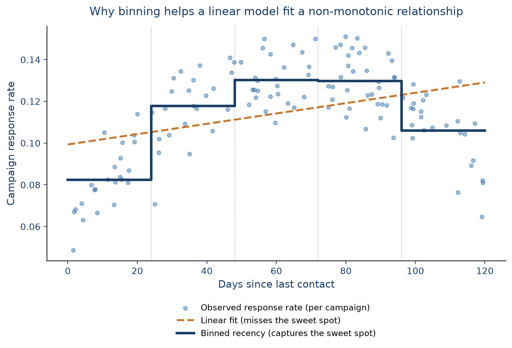

# Data Preparation

The previous chapter cleaned up `train_data` and `test_data`: missing values imputed, negative
ages fixed, multicollinearity flagged. That's a proper dataset to explore, but most of it still
can't go into a predictive model as-is: categorical columns need to become numbers, some continuous
variables would benefit from being simplified, and every feature needs to be on a scale a model
can work with. That's what **data preparation** covers.

It's easy to underestimate how much this step matters. Some authors argue that it's the data
preparation, not the algorithm, that mainly drives predictive performance
[@coussement2017comparative]. Variables get transformed or reduced for a few reasons: to be
interpretable, to overcome bias, to actually be usable by a given model, and simply to carry more
predictive value than the raw column did. It's also the most time-consuming step of the whole
process, which is exactly why it's worth doing carefully.

Broadly, this chapter covers four things:

- **Value transformation**: turning continuous variables into simpler categorical ones.
- **Value representation**: turning categorical variables into a numeric form a model can use.
- **Feature engineering**: creating new features and transforming existing ones to help a model
  fit better.
- **Variable selection**: reducing the number of features to only those that actually carry predictive value.

Let's pick up where the previous chapter left off, and load the cleaned training and test sets:

```{python}
import pandas as pd
import numpy as np
import matplotlib.pyplot as plt
import seaborn as sns

train_complete = pd.read_parquet("../data/raw/train_complete.parquet")
train_data = train_complete.drop(columns=["target"])
train_target = train_complete["target"]

test_complete = pd.read_parquet("../data/raw/test_complete.parquet")
test_data = test_complete.drop(columns=["target"])
test_target = test_complete["target"]

print(f"Training data shape: {train_data.shape}")
train_data["Age"].describe()
```

## Value transformations

### Continuous categorization (binning)

**Binning** (also called discretization, coarse-classification, or classing) transforms a
continuous variable into a categorical one with a handful of ranges instead of many individual
values. There are two main reasons to do this:

- **Fewer parameters to estimate:** A categorical variable with a lot of levels (e.g., in our case the `ZIP`
  variable has well over a hundred) needs one dummy variable per level (minus
  one) in an analytical model. Grouping those levels into a handful of bins keeps the model far
  more compact and robust.
- **Capturing non-monotonic relationships in linear models:** A linear model can only fit a
  straight line. If the true relationship between a variable and the outcome isn't monotonic,
  binning lets a linear model approximate it anyway, since each bin gets its own coefficient. For 
  example, in a real credit-scoring model @vangool2012credit find exactly this for requested loan 
  duration: the
  riskiest loans turn out to be the medium-term ones, not the longest ones. This is a pattern a 
  single linear term would have missed entirely, and one their binned model picks up directly.

@fig-binning-recency illustrates the second point with a hypothetical marketing example: a
campaign's response rate against how many days it's been since the customer was last contacted.
Response is low right after contact (fatigue since nobody likes being messaged twice in a row),
climbs to a "sweet spot" a few weeks out, then drops again as the customer disengages. A straight
line can't capture this rise-then-plateau-then-fall pattern. What it actually does is create a misleading
representation of the true relationship. Binning recency into a handful of ranges lets even a plain linear model
pick up the sweet spot, since each range gets its own estimated response level.

{#fig-binning-recency fig-alt="Scatter plot of an inverted-U relationship between days since last contact and campaign response rate, with a shallow, misleading linear fit and a five-step binned function closely tracking the true rise-then-fall pattern."}

Two very basic binning strategies are **equal-width binning** (bins created with the same range of
values) and **equal-frequency binning** (bins containing the same number of observations). Both
are simple but don't take the target variable into account at all. For categorical variables, the
equivalent ideas are **grouping** (combining several levels into one) and **remapping** (rebuilding
categories around their relationship with the target, e.g. via a chi-square analysis).

`sklearn` has `KBinsDiscretizer`, but `feature-engine` offers more convenient binning
transformers:

- **`EqualFrequencyDiscretiser`**: equal-frequency bins.
- **`EqualWidthDiscretiser`**: equal-width bins.
- **`DecisionTreeDiscretiser`**: uses a decision tree to find the optimal split points taking into account the target variable (out of
  scope here).

As with everything so far, binning is *fit* on the training data only, then *applied* or *transformed* to the test
set:

```{python}
from feature_engine.discretisation import EqualFrequencyDiscretiser, EqualWidthDiscretiser

freq_binner = EqualFrequencyDiscretiser(variables=["Age"], q=10)
train_freq_binned = freq_binner.fit_transform(train_data)

width_binner = EqualWidthDiscretiser(variables=["Age"], bins=3)
train_width_binned = width_binner.fit_transform(train_data)

print("Equal-frequency bin edges (10 bins):")
print(freq_binner.binner_dict_["Age"])

print("\nEqual-width bin edges (3 bins):")
print(width_binner.binner_dict_["Age"])
```

Whether a binning is actually *useful* is a separate question from whether it's *possible*. The
way to check is to look at how well it separates the outcome you care about. If churn rate differs
clearly and fairly monotonically across bins, and each bin still has enough observations to be
reliable, the binning is doing real work:

```{python}
train_freq_binned["churn"] = train_target
train_width_binned["churn"] = train_target

freq_churn = train_freq_binned.groupby("Age")["churn"].agg(["mean", "count"])
width_churn = train_width_binned.groupby("Age")["churn"].agg(["mean", "count"])

fig, (ax1, ax2) = plt.subplots(1, 2, figsize=(12, 4))
freq_churn["mean"].plot(kind="bar", ax=ax1, title="Churn Rate: Equal-Frequency Bins")
width_churn["mean"].plot(kind="bar", ax=ax2, title="Churn Rate: Equal-Width Bins")
for ax in [ax1, ax2]:
    ax.set_ylabel("Churn Rate")
plt.tight_layout()
plt.show()
```

The bars are worth reading with actual numbers next to them:

```{python}
print("Equal-frequency bins (target: 10):")
print(freq_churn)
print("\nEqual-width bins (target: 3):")
print(width_churn)
```

Two things stand out:

- **Equal-frequency only produced 6 bins, not the requested 10.** `Age` has a lot of repeated
  values, so several of the 10 requested quantile edges collapsed onto the same value. This is very common
  in quantile-based binning whenever a variable has many ties.
- **Neither binning is straightforwardly reliable.** Equal-width binning *looks* like the cleaner
  story (e.g., churn drops monotonically from bin to bin) but its first bin holds only 15
  observations, far too few to trust a 53% churn rate from. Equal-frequency binning has properly
  sized bins throughout, but the churn rate across them doesn't move monotonically at all
  (35% → 32% → 27% → 13% → 18% → 25%): it dips, then partly recovers.

The take-away: binning `Age` this way doesn't reveal a strong, trustworthy relationship with
churn here. It means `Age` on its own is
a weaker predictor of churn than the binning exercise might have hoped to show, and any apparent
pattern (like the width-binned one) needs its bin sizes checked before it's believed. Therefore, we'll leave `Age` as a continuous variable for now, and move on to the next step: representing categorical variables numerically.

## Value representations

The most common way to represent a discrete variable numerically is **one-hot (dummy) encoding**. In short, each category of a variable becomes its own 0/1 column or *dummy variable*.
For example, an `Income category` variable with levels *High*, *Medium*, and *Low* becomes three
0/1 columns, one of which is typically dropped as the **reference category** to avoid
multicollinearity between the dummies:

| Income category | Income_high | Income_medium |
|---|---|---|
| High | 1 | 0 |
| Medium | 0 | 1 |
| Low | 0 | 0 |

One-hot encoding works well as long as the number of categories stays manageable. When a variable
has many categories, it needs a different treatment, covered in its own section below (**Weight
of Evidence**), since it's important enough to deserve one.

### One-hot encoding

For a categorical variable with a limited number of categories (say, fewer than 10), one-hot
encoding is usually the right default since it is:

- **Simple to interpret**: each dummy is just presence/absence of one category.
- **No information loss**: every original category is preserved (unlike binning).
- **Broadly compatible**: works with linear models and tree-based models alike.

One thing to watch for in a predictive setting: training and test data need to end up with the
*same* dummy columns. If a category shows up only in the test set, a model trained without it
simply can't make use of it. `sklearn`'s `OneHotEncoder`, fit on the training set with
`handle_unknown="ignore"`, handles this cleanly. Any category the test set has that training
didn't will just come out as all zeros, rather than raising an error.

Let's apply it to `Gender` and `District`:

```{python}
from sklearn.preprocessing import OneHotEncoder

categorical_vars = ["Gender", "District"]

train_cats = {var: set(train_data[var].unique()) for var in categorical_vars}
test_cats = {var: set(test_data[var].unique()) for var in categorical_vars}

inconsistencies = {var: test_cats[var] - train_cats[var] for var in categorical_vars if test_cats[var] != train_cats[var]}
if inconsistencies:
    print(f"Categories in test but not train: {inconsistencies}")
else:
    print("Train and test sets have consistent categories")
```

```{python}
# drop="first" avoids the dummy-variable multicollinearity from the reference category above
# handle_unknown="ignore" sets any unseen test-time category to all zeros
dummy_encoder = OneHotEncoder(drop="first", sparse_output=False, handle_unknown="ignore")
dummy_encoder.fit(train_data[categorical_vars])

feature_names = dummy_encoder.get_feature_names_out(categorical_vars)
print(f"Feature names after dummy encoding: {feature_names}")

train_dummies = pd.DataFrame(
    dummy_encoder.transform(train_data[categorical_vars]),
    columns=feature_names, index=train_data.index,
)
test_dummies = pd.DataFrame(
    dummy_encoder.transform(test_data[categorical_vars]),
    columns=feature_names, index=test_data.index,
)

print(f"Training dummies shape: {train_dummies.shape}")
print(f"Test dummies shape: {test_dummies.shape}")
train_dummies.head()
```

Finally, swap the original categorical columns for their dummy versions:

```{python}
train_with_dummies = pd.concat([train_data.drop(columns=categorical_vars), train_dummies], axis=1)
test_with_dummies = pd.concat([test_data.drop(columns=categorical_vars), test_dummies], axis=1)

print(f"Training data with dummies shape: {train_with_dummies.shape}")
print(f"Test data with dummies shape: {test_with_dummies.shape}")
```

### Weight of Evidence

Two variables in our data, `ZIP` and `StreeID`, are still not usable: they have far too many
categories for one-hot encoding to be practical. Turning either one into dummies would blow up
the number of predictors and increase computation time enormously. There are two common ways to
handle this:

1. **Keep only the top categories** by frequency, grouping everything else into "other". Simple,
   but throws away information.
2. **Weight of Evidence (WoE)**, which is much better suited to high-cardinality variables.

Let's first check just how high the cardinality actually is:

```{python}
high_cardinality_vars = ["ZIP", "StreeID"]

for var in high_cardinality_vars:
    unique_count = train_with_dummies[var].nunique()
    print(f"{var}: {unique_count} unique categories")
```

**Weight of Evidence** summarizes a categorical variable into a
single numeric column, computed per category as:

$$\text{WOE} = \ln\left(\frac{\text{\% of positives}}{\text{\% of negatives}}\right)$$

where "positive" and "negative" refer to the two classes of a binary target (here, churners and
non-churners respectively) matching how `churn` is coded (1/0) throughout this book. A positive
WoE means a category has relatively more positives (churners) than negatives; a negative WoE means
the opposite. It's widely used in practice, particularly in credit scoring
[@vangool2012credit].

WoE belongs to a broader family of techniques called **target statistics** (also called target
encoding): replace each category with some summary of the target computed within that category.
The simplest version computes each category's raw target mean, which we'll use directly later in
this chapter for ordinal variables. That simplest version has a real weakness on a variable like
`ZIP`, though: many categories have only a handful of observations, and a mean computed from three
or four rows is noise dressed up as a number, not a genuine signal. @micci-barreca2001preprocessing
shows this is exactly why a per-category target mean is normally blended with the overall mean
(shrinkage) rather than used raw, and @prokhorenkova2018catboost describes the same failure mode,
there called *target leakage*, as the reason more recent methods such as CatBoost's ordered target
statistics exist at all. That's a reliability problem shared by *any* target statistic, WoE
included, which is exactly why grouping rare categories comes first (Step 2 below), before
computing anything: it protects whichever statistic you use from being estimated on an unreliably
small group.

So why WoE specifically instead of the raw target mean, even after that protection is in place?
Two reasons. First, @moeyersoms2015highcardinality directly
compared a raw target-ratio encoding against WoE on a real churn-prediction dataset and found WoE
gave the best results across several classifiers, including logistic regression. Second, its scale
fits a model like logistic regression more naturally: WoE is a log-odds transform, and logistic
regression predicts log-odds, not probability, so a WoE-encoded category sits on the same scale the
model is actually estimating, whereas a raw target mean (a bounded probability) doesn't, and tends
to behave less smoothly as a category's rate approaches 0% or 100%.

A closely related metric is the **Information Value (IV)**, which sums a weighted version of the
WoE across all categories of a variable into a single number summarizing how predictive that whole
variable is: $\text{IV} = \sum_i (\%\text{positive}_i - \%\text{negative}_i) \times \text{WOE}_i$.

An illustrative example below shows how to compute WoE and IV for a
hypothetical `PaymentType` variable against churn (positive = churner, negative = non-churner):

| PaymentType | Count | Distr. Count | Positive | Distr. Positive | Negative | Distr. Negative | WOE | IV |
|---|---|---|---|---|---|---|---|---|
| Direct debit | 800 | 40.00% | 50 | 13.51% | 750 | 46.01% | −1.2252 | 0.3982 |
| Bank transfer | 500 | 25.00% | 80 | 21.62% | 420 | 25.77% | −0.1754 | 0.0073 |
| Credit card | 450 | 22.50% | 120 | 32.43% | 330 | 20.25% | +0.4712 | 0.0574 |
| Cash | 250 | 12.50% | 120 | 32.43% | 130 | 7.98% | +1.4028 | 0.3431 |
| **Total** | **2000** | | **370** | | **1630** | | | **0.8060** |

Cash customers churn far more than the base rate (a strongly positive WoE), direct debit customers
churn far less (a strongly negative WoE), and the variable's total IV of 0.81 would count as a
**strong** predictor by the usual rule of thumb:

| IV | Predictive power |
|---|---|
| < 0.02 | Unpredictive |
| 0.02 to 0.1 | Weak |
| 0.1 to 0.3 | Medium |
| > 0.3 | Strong |

Two things make WoE attractive for high-cardinality variables: it **reduces dimensionality** (many
categories become one numeric column), and it creates a **monotonic relationship** with the
target, which linear models can exploit directly.

Implementing WoE takes a few steps: check data quality, group rare categories, fit WoE, then apply
it to build the final dataset.

**Step 1: check data quality.** WoE breaks down for a category that's 100% or 0% one class (the
log ratio is undefined), so it's worth checking how common that is per variable first. A rough
heuristic: if more than about 80% of a variable's categories are problematic like this, it's
probably not a good candidate for WoE at all.

```{python}
train_demo = train_with_dummies.copy()
train_demo["churn"] = train_target

for var in high_cardinality_vars:
    churn_analysis = train_demo.groupby(var).agg(
        Total_Count=("churn", "count"), Churn_Count=("churn", "sum"), Churn_Rate=("churn", "mean"),
    ).round(3)

    problematic = churn_analysis[(churn_analysis["Churn_Rate"] == 0) | (churn_analysis["Churn_Rate"] == 1)]

    print(f"{var}: {len(churn_analysis)} categories, {len(problematic)} problematic "
          f"({len(problematic) / len(churn_analysis):.0%})")
```

`StreeID` turns out to be almost entirely problematic categories, so we'll exclude it from WoE
and just drop it later. `ZIP` looks usable.

**Step 2: group rare categories.** Before fitting WoE, grouping infrequent categories into a
single "Rare" bucket with `RareLabelEncoder` makes the resulting WoE values more stable:

```{python}
from feature_engine.encoding import RareLabelEncoder

suitable_vars = ["ZIP"]

rare_encoder = RareLabelEncoder(tol=0.02, n_categories=5, variables=suitable_vars, ignore_format=True)

train_rare = rare_encoder.fit_transform(train_demo[suitable_vars])
train_rare["churn"] = train_demo["churn"].values

test_demo = test_with_dummies.copy()
test_rare = rare_encoder.transform(test_demo[suitable_vars])

print(f"ZIP: {train_rare['ZIP'].nunique()} categories after grouping (was {train_demo['ZIP'].nunique()})")
```

**Step 3: fit WoE on the training set, apply to both:**

```{python}
from feature_engine.encoding import WoEEncoder

woe_encoder = WoEEncoder(variables=suitable_vars, ignore_format=True)
woe_encoder.fit(train_rare[suitable_vars], train_rare["churn"])

train_woe = woe_encoder.transform(train_rare[suitable_vars])
test_woe = woe_encoder.transform(test_rare[suitable_vars])

woe_summary = pd.DataFrame({"Category": train_rare["ZIP"], "WoE": train_woe["ZIP"]}).drop_duplicates()
woe_summary = woe_summary.merge(train_rare.groupby("ZIP")["churn"].agg(["count", "mean"]), left_on="Category", right_index=True)
woe_summary.columns = ["Category", "WoE", "Count", "Churn_Rate"]
woe_summary.sort_values("WoE", ascending=False).round(4)
```

**Step 4: assemble the final dataset**, replacing `ZIP` with its WoE column and dropping `StreeID`
entirely:

```{python}
train_final = train_with_dummies.copy()
test_final = test_with_dummies.copy()

train_final["ZIP_woe"] = train_woe["ZIP"].values
test_final["ZIP_woe"] = test_woe["ZIP"].values

train_final = train_final.drop(columns=["ZIP", "StreeID"])
test_final = test_final.drop(columns=["ZIP", "StreeID"])

print(f"Training set: {train_final.shape}")
print(f"Test set: {test_final.shape}")
```

::: {.callout-tip}
## Dummy encoding vs. WoE: use both, for different variables

They try to solve the same problem, namely turning a categorical variable into numbers, but they're not really competitors, since they sit
at opposite ends of the cardinality spectrum. Dummy encoding preserves the most detail per
category but doesn't scale well after 10 categories; WoE scales to hundreds of categories and
guarantees a monotonic relationship with the target, at the cost of collapsing each category down
to a single number. In practice, a single dataset often needs both at once, depending on the needs
of different columns, which is exactly as we just did.
:::

## Feature engineering

**Feature engineering** is the process of creating new features, or transforming existing ones, to
help a model perform better in terms of predictive performance, interpretability, or both.
It pays to keep the target model's biases in mind: a linear model needs features that separate the
classes roughly linearly, so a raw date-of-birth column is far less useful to it than an age
computed from it.

**Recency, Frequency, and Monetary value (RFM)** features are a classic example of this kind of
engineering [@baesens2021dataengineering]: instead of feeding a model per-transaction data, 
summarize each customer's behavior along three simple dimensions:

- **Recency**: how long since the customer's last transaction, payment, or contact.
- **Frequency**: how often the customer transacts, e.g. per month or per year.
- **Monetary**: how much value those transactions carry, e.g. average, minimum, or maximum spend.

A fourth dimension, **length of relationship** (time since the customer's *first* transaction), is
often added alongside the classic three. In fact, it's closely related to the customer-tenure and 
duration modeling used in CRM attrition research [@VandenPoel2004]. Each dimension can also be
operationalized in several ways: frequency over different windows (last month vs. last year),
monetary value summarized differently (average vs. highest vs. lowest), or any of the above
computed separately per product, time period, or channel. RFM-style features are heavily used in
CRM [@buckinx2005customer], fraud analytics [@baesens2021dataengineering], and credit scoring 
[@hsieh2004integrated].
Several of the aggregated columns already in our dataset (purchase counts, average discount, days
since last payment) are exactly this kind of feature. We won't build RFM features from scratch
here since they're already present, but it's worth knowing the term and the
reasoning behind it.

Let's take stock of where the dataset stands after value representation:

```{python}
print(f"Shape: {train_final.shape}")
train_final.head()
```

### Non-linear relationships

#### Visual inspection for non-linear relationships

Before reaching for a transformation, it's worth checking whether one is actually needed. A
convenient way to do that for a binary target is to fit a logistic regression on everything, then
plot each feature against the model's **logit** (the log-odds it predicts). If a LOESS curve through that relationship tracks a straight line closely, the feature is already behaving
roughly linearly with respect to the target; if it diverges, a transformation might help.

```{python}
from sklearn.linear_model import LogisticRegression

numerical_features = ["TotalDiscount_mean", "PaymentDate_rec"]
X_demo = train_final[numerical_features].copy()
y_demo = train_target.copy()

model = LogisticRegression(random_state=42, max_iter=1000)
model.fit(train_final, train_target)

probabilities = np.clip(model.predict_proba(train_final)[:, 1], 1e-10, 1 - 1e-10)
logits = np.log(probabilities / (1 - probabilities))

fig, axes = plt.subplots(1, len(numerical_features), figsize=(5 * len(numerical_features), 4))
for i, feature in enumerate(numerical_features):
    sns.regplot(x=X_demo[feature], y=logits, ax=axes[i], scatter_kws={"alpha": 0.5, "s": 10},
                lowess=True, line_kws={"color": "red", "linewidth": 2, "label": "Lowess smooth"})
    sns.regplot(x=X_demo[feature], y=logits, ax=axes[i], scatter=False,
                line_kws={"color": "blue", "linewidth": 2, "linestyle": "--", "label": "Linear fit"})
    axes[i].set_xlabel(feature)
    axes[i].set_ylabel("Logit")
    axes[i].set_title(f"Logit vs {feature}")
    axes[i].legend()

plt.tight_layout()
plt.show()
```

The two lines are close for both features here, which suggests a fairly linear relationship
already. `TotalDiscount_mean` diverges slightly more than `PaymentDate_rec`, so it's the more
plausible candidate for a transformation. Let's try a couple anyway, to see what they'd actually
buy us.

#### Polynomial features

**Polynomial features** add higher-order and interaction terms, letting a linear model capture
curvature it otherwise couldn't. Let's create a degree-2 polynomial expansion of
`TotalDiscount_mean`:

```{python}
from sklearn.preprocessing import PolynomialFeatures

target_feature = numerical_features[0]

poly_transformer = PolynomialFeatures(degree=2, include_bias=False)
target_poly = poly_transformer.fit_transform(train_final[[target_feature]])
poly_names = poly_transformer.get_feature_names_out([target_feature])

target_poly_df = pd.DataFrame(target_poly, columns=poly_names, index=train_final.index)
print(f"New polynomial features: {list(poly_names)}")
```

Adding it to the dataset and comparing training accuracy against the original model shows whether
it actually helped:

```{python}
train_final_with_poly = pd.concat([train_final, target_poly_df.iloc[:, 1:]], axis=1)  # skip the original feature

model_poly = LogisticRegression(random_state=42, max_iter=1000)
model_poly.fit(train_final_with_poly, train_target)

original_score = model.score(train_final, train_target)
poly_score = model_poly.score(train_final_with_poly, train_target)

print(f"Original accuracy: {original_score:.4f}")
print(f"With polynomial feature: {poly_score:.4f}  (Δ = {poly_score - original_score:+.4f})")
```

#### Power transformations

**Power transformations** reshape a variable's distribution, often to make it more
Gaussian-like and to stabilize its variance, which can help both linear models and any method that
assumes a normal distribution of errors. A simple **logarithmic transformation** (`x -> log(x)`, or
`x -> log(1 + x)` when zeros are present) is the most common case, typically applied to
strictly-positive, right-skewed "size" variables like loan amounts or revenue. More general power
transforms (`x -> x^λ`) trade off skew in either direction depending on λ, at the cost of needing
to fit that λ.

**Box-Cox** and **Yeo-Johnson** are the two standard ways to fit λ automatically rather than
guessing it. Box-Cox only works for strictly positive values; Yeo-Johnson extends it to handle
zero and negative values too (and reduces to Box-Cox exactly when all values are positive). In
`sklearn`, this works the same way as everything else fit in this book: `PowerTransformer`'s
`.fit()` estimates λ directly from the training data (i.e., the value that makes the transformed
distribution closest to Gaussian) rather than you having to search for it by hand. Let's try
Yeo-Johnson on the same feature:

```{python}
from sklearn.preprocessing import PowerTransformer

power_transformer = PowerTransformer(method="yeo-johnson", standardize=False)
target_transformed = power_transformer.fit_transform(train_final[[target_feature]])

print(f"Optimal lambda: {power_transformer.lambdas_[0]:.4f}")

fig, axes = plt.subplots(1, 2, figsize=(12, 4))
axes[0].hist(train_final[target_feature], bins=30, alpha=0.7, color="#2f6faa")
axes[0].set_title(f"Original {target_feature}")
axes[1].hist(target_transformed[:, 0], bins=30, alpha=0.7, color="#c9772e")
axes[1].set_title(f"Yeo-Johnson transformed {target_feature}")
plt.tight_layout()
plt.show()
```

```{python}
train_final_with_yj = train_final.copy()
train_final_with_yj[f"{target_feature}_yj"] = target_transformed.flatten()

model_yj = LogisticRegression(random_state=42, max_iter=1000)
model_yj.fit(train_final_with_yj, train_target)

yj_score = model_yj.score(train_final_with_yj, train_target)
print(f"Original accuracy: {original_score:.4f}")
print(f"With Yeo-Johnson feature: {yj_score:.4f}  (Δ = {yj_score - original_score:+.4f})")
```

In this case, neither the polynomial term nor the Yeo-Johnson transform moved training accuracy
much. This is consistent with the logit plots above, which already showed a fairly linear 
relationship.
That's a useful negative result: it means we can discard both here rather than carrying extra,
unhelpful complexity forward.

That's not always the case, though. Sometimes a transformation like this is the difference
between a model that's good enough to detect a real, actionable relationship and one that isn't.
@wang2019optimal study how a seller's mix of marketing versus non-marketing social media posts
relates to how popular those posts become, and specifically whether there's an *optimal* level of
marketing aggressiveness. The effect of aggressiveness level is an inverted U-shape curve, 
quantified with a quadratic term in a plain linear regression too. But applying a 
Yeo-Johnson 
transform to one of their control variables (a seller's number of followers) nearly triples the
model's R² compared to the untransformed version. The take-away: the transformation itself
didn't reveal the U-shape; it made the model reliable enough to trust the U-shape it found.

::: {.callout-note}
## Interaction effects

Sometimes a variable has no linear effect on its own: $y \not\leftarrow f(x_1)$ and
$y \not\leftarrow f(x_2)$ individually, but the *combination* $y \leftarrow f(x_1, x_2)$ does, often
represented simply as the product $x_1 \times x_2$. A classic example: `Gender` on its own might
show no relationship with an outcome, but `Gender × Income` might, if the effect of income differs
by gender. This is sometimes called moderation, with the interaction term acting as the moderator.
:::

## Standardization and normalization

Different algorithms need scaling for different reasons: distance-based methods like k-nearest 
neighbors and linear models with regularization need it directly, neural networks need it to avoid 
numerical overflow, and tree-based models don't need it at all. The two most common approaches are:

- **Standardization**: rescale to mean 0, standard deviation 1 (the z-score). Good for distance-based
  algorithms and for comparing coefficients across features.
- **Min-max normalization**: rescale to a fixed range, typically [0, 1]. Common for neural
  networks and any method that expects bounded input.

As with the transformations above, `sklearn` estimates the numbers each scaler needs directly from
the data: `StandardScaler.fit()` computes each feature's mean and standard deviation,
`MinMaxScaler.fit()` computes its min and max, and `.transform()` applies them.

```{python}
from sklearn.preprocessing import StandardScaler, MinMaxScaler

scaler_standard = StandardScaler()
X_demo_standardized = pd.DataFrame(scaler_standard.fit_transform(X_demo), columns=X_demo.columns)

scaler_minmax = MinMaxScaler()
X_demo_normalized = pd.DataFrame(scaler_minmax.fit_transform(X_demo), columns=X_demo.columns)

fig, axes = plt.subplots(3, len(X_demo.columns), figsize=(4 * len(X_demo.columns), 8))
for i, feature in enumerate(X_demo.columns):
    axes[0, i].hist(X_demo[feature], bins=30, alpha=0.7, color="#2f6faa")
    axes[0, i].set_title(f"Original {feature}")
    axes[1, i].hist(X_demo_standardized[feature], bins=30, alpha=0.7, color="#1a3f66")
    axes[1, i].set_title(f"Standardized {feature}")
    axes[2, i].hist(X_demo_normalized[feature], bins=30, alpha=0.7, color="#c9772e")
    axes[2, i].set_title(f"Normalized {feature}")

plt.tight_layout()
plt.show()
```

::: {.callout-warning}
## Fit on training, transform on test and never scale dummy variables!

The fit-on-train, transform-on-both rule from the previous chapter applies here too: fit the
scaler on training data only, then use it to transform both sets. There's a second, easy-to-miss
mistake specific to scaling: **don't scale dummy/binary columns**. A one-hot column only ever
takes the values 0 and 1, and standardizing it doesn't make it more useful. More importantly, it
destroys the direct
0/1 interpretation. Hence, only continuous features should go through the scaler.
:::

```{python}
binary_features, continuous_features = [], []
for col in train_final.columns:
    unique_values = set(train_final[col].unique())
    if unique_values == {0, 1}:
        binary_features.append(col)
    else:
        continuous_features.append(col)

print(f"Binary features (not scaled): {len(binary_features)}")
print(f"Continuous features (scaled): {len(continuous_features)}")

train_binary, train_continuous = train_final[binary_features], train_final[continuous_features]
test_binary, test_continuous = test_final[binary_features], test_final[continuous_features]
```

```{python}
scaler = StandardScaler()
scaler.fit(train_continuous)

train_continuous_scaled = pd.DataFrame(
    scaler.transform(train_continuous), columns=continuous_features, index=train_final.index,
)
test_continuous_scaled = pd.DataFrame(
    scaler.transform(test_continuous), columns=continuous_features, index=test_final.index,
)

# recombine, keeping the original column order
train_final_scaled_df = pd.concat([train_continuous_scaled, train_binary], axis=1)[train_final.columns]
test_final_scaled_df = pd.concat([test_continuous_scaled, test_binary], axis=1)[test_final.columns]

print(f"Final scaled training shape: {train_final_scaled_df.shape}")
print(f"Final scaled test shape: {test_final_scaled_df.shape}")
```

| Transformation | When to use | Example algorithms |
|---|---|---|
| Standardization | Distance-based methods, comparing coefficients | SVM, KNN, linear/logistic regression |
| Min-max normalization | Bounded features needed | Neural networks, some clustering methods |
| Polynomial features | Non-linear relationships in a linear model | Linear/logistic regression |
| Power transforms | Skewed data, improving normality | Linear models, parametric tests |
| No scaling | Split-based models | Random forests, gradient boosting, decision trees |

## Variable selection

Real datasets usually come with far more variables than actually needed to achieve good predictive
performance. Searching every possible subset is computationally infeasible (even in today's world). 
So **variable selection** methods use a heuristic instead: keep predictors that are strongly 
related to the
response and weakly related to each other, and drop the rest. In other words, delete both the ones 
that are
**irrelevant** (unrelated to the target) and the ones that are **redundant** (correlated with
another predictor that already carries the same information). This isn't purely a matter of
convenience: more compact models are also faster to estimate, and can genuinely perform *better* 
(thanks to the curse of
dimensionality), since more variables for a fixed number of
observations makes the prediction task harder, not easier [@verbeke2012newinsights].

Three broad families of methods exist: **filter** methods (fast, univariate, model-independent), **wrapper** methods (recursive feature elimination, and stepwise selection, considered more
expensive since they retrain a model repeatedly), and **embedded** methods (regularization such as
L1/L2/elastic net, built directly into the model-fitting process). Filter methods are covered here, and the other two families are introduced in the next chapters.

### Filter methods

Filter methods score each predictor's univariate relationship with the target, independent of any
model, which makes them a fast first screening pass. Which score to use depends on the variable
type:

|  | Continuous target | Categorical target |
|---|---|---|
| Continuous variable | Pearson correlation | Fisher score / ANOVA |
| Categorical variable | Fisher score / ANOVA | Information Value, Cramér's V |

For our continuous features against the (categorical) churn target, `sklearn`'s `f_classif` plays
the role of the Fisher score, paired with `SelectKBest` to keep only the top-scoring ones:

```{python}
from sklearn.feature_selection import SelectKBest, f_classif

k_best_numerical = min(20, len(continuous_features))
selector_numerical = SelectKBest(score_func=f_classif, k=k_best_numerical)
selector_numerical.fit(train_continuous_scaled, train_target)

selected_numerical_features = np.array(continuous_features)[selector_numerical.get_support()].tolist()

numerical_results = pd.DataFrame({
    "feature": continuous_features, "f_score": selector_numerical.scores_,
}).sort_values("f_score", ascending=False)

numerical_results.head(10)
```

For the binary (dummy) features, chi-squared and mutual information are the equivalent tools:

```{python}
from sklearn.feature_selection import mutual_info_classif, chi2

k_best_categorical = min(5, len(binary_features))

selector_chi2 = SelectKBest(score_func=chi2, k=k_best_categorical)
selector_chi2.fit(train_binary, train_target)
selected_chi2 = [f for f, keep in zip(binary_features, selector_chi2.get_support()) if keep]

selector_mi = SelectKBest(score_func=mutual_info_classif, k=k_best_categorical)
selector_mi.fit(train_binary, train_target)
selected_mi = [f for f, keep in zip(binary_features, selector_mi.get_support()) if keep]

print(f"Top by chi-squared: {selected_chi2}")
print(f"Top by mutual information: {selected_mi}")
```

Combining the two: take every continuous feature the numerical filter selected, plus only the
binary features *both* categorical filters agreed on:

```{python}
selected_binary = list(set(selected_chi2) & set(selected_mi))
all_selected_features = selected_numerical_features + selected_binary

train_final_selected = train_final_scaled_df[all_selected_features]
test_final_selected = test_final_scaled_df[all_selected_features]

print(f"Selected {len(all_selected_features)} features "
      f"({len(selected_numerical_features)} continuous, {len(selected_binary)} binary), "
      f"down from {train_final_scaled_df.shape[1]}")
```

Filter methods are fast and a good first pass, but they're univariate. They don't account for
correlations *between* features, so a certain amount of redundancy can slip through. That's
exactly why they're normally used as a quick first cut, often followed by a wrapper or embedded
method for the final selection. Determining the actual optimal number of features is left for
later, once cross-validation is introduced.

## Ordinal encoding

**Ordinal variables** have a natural ranking in their categories (e.g., credit rating, education
level, or a customer loyalty tier) unlike a plain nominal categorical variable like `Gender` or
`District`. Our dataset doesn't happen to have one, so to demonstrate the encoding options, we'll
build a synthetic **customer value tier** from two existing features: total product purchases and
payment recency.

::: {.callout-note}
## This section is a synthetic, self-contained demo

The customer tiers and the churn labels used below are artificially generated purely to
illustrate the three encoding methods. They are *not* the real `churn` target from earlier in the
chapter, even though the code reuses familiar variable names for convenience.
:::

```{python}
np.random.seed(42)

product_cols = [col for col in train_final.columns if "ProductID" in col and "_sum" in col]
total_products = train_final[product_cols].sum(axis=1)
recency_factor = 1 / (1 + train_final["PaymentDate_rec"])
value_score = total_products * 0.7 + recency_factor * 0.3

q1, q2, q3 = np.percentile(value_score, [25, 50, 75])

def assign_tier(score):
    if score <= q1:
        return "Bronze"
    elif score <= q2:
        return "Silver"
    elif score <= q3:
        return "Gold"
    return "Platinum"

customer_tiers = [assign_tier(score) for score in value_score]
print(pd.Series(customer_tiers).value_counts())
```

```{python}
# Synthetic churn, deliberately lower for higher tiers, so the encodings below have something to pick up on
tier_churn_probs = {"Bronze": 0.6, "Silver": 0.4, "Gold": 0.25, "Platinum": 0.15}
synthetic_churn = [np.random.binomial(1, tier_churn_probs[tier]) for tier in customer_tiers]

X_train_ordinal = pd.DataFrame({"customer_tier": customer_tiers})
y_train_ordinal = pd.Series(synthetic_churn, name="churn")

print(pd.DataFrame({"customer_tier": customer_tiers, "churn": synthetic_churn})
      .groupby("customer_tier")["churn"].agg(["mean", "count"]).round(3))
```

**Manual ordinal encoding** uses domain knowledge to specify the order directly (Bronze < Silver
< Gold < Platinum):

```{python}
from sklearn.preprocessing import OrdinalEncoder

tier_order = [["Bronze", "Silver", "Gold", "Platinum"]]
sklearn_encoder = OrdinalEncoder(categories=tier_order)
sklearn_encoder.fit(X_train_ordinal)

print("Bronze → 0, Silver → 1, Gold → 2, Platinum → 3")
```

**Automated ordinal encoding** orders categories by their relationship with the target
instead of by domain knowledge. `feature-engine`'s version always orders ascending by target
mean:

```{python}
from feature_engine.encoding import OrdinalEncoder as FeatureEngineOrdinalEncoder

fe_encoder = FeatureEngineOrdinalEncoder(variables=["customer_tier"])
fe_encoder.fit(X_train_ordinal, y_train_ordinal)

print(f"Categories ordered by churn rate (ascending): {fe_encoder.encoder_dict_['customer_tier']}")
```

**Target (mean) encoding** goes a step further and replaces each category with the actual
mean of the target for that category, rather than just a rank. This is the plain target statistic
flagged back in the Weight of Evidence section. Here, it's reliable enough since our synthetic tiers are
each backed by hundreds of observations. But remember, this is exactly the kind of raw, unshrunk per-category mean
that gets noisy fast on a variable with many small categories:

```{python}
from feature_engine.encoding import MeanEncoder

target_encoder = MeanEncoder(variables=["customer_tier"])
target_encoder.fit(X_train_ordinal, y_train_ordinal)

print(f"Encoding: {target_encoder.encoder_dict_['customer_tier']}")
```

```{python}
comparison = pd.DataFrame({
    "customer_tier": X_train_ordinal["customer_tier"].unique(),
})
comparison["sklearn_ordinal"] = [sklearn_encoder.categories_[0].tolist().index(t) for t in comparison["customer_tier"]]
comparison["feature_engine_ordinal"] = comparison["customer_tier"].map(fe_encoder.encoder_dict_["customer_tier"])
comparison["target_encoding"] = comparison["customer_tier"].map(target_encoder.encoder_dict_["customer_tier"])
comparison.sort_values("target_encoding")
```

Which to use depends on what you have and what you need:

- **Manual encoding**: use when you have a clear, defensible business hierarchy. It stays
  interpretable, but isn't necessarily optimal for prediction.
- **Automated (feature-engine) encoding**: use when you'd rather let the data reveal the order.
  Useful for finding surprising patterns, at some cost to interpretability (e.g., it might not be obvious *why*
  Platinum ends up coded as 0 in a given fit).
- **Target encoding**: use when predictive power matters most. It creates the strongest statistical
  relationship with the target, but is also the most prone to overfitting, especially with small
  categories, and needs careful cross-validation (or an approach like WoE) to use safely.

## Putting it all together

The exact order can vary by project, but a reasonable default sequence for everything covered in
this chapter (and the previous one) is:

1. Impute missing values.
2. Resolve outliers and other data quality issues.
3. Engineer individual features (transformations, computed columns).
4. Discretize, where useful.
5. Encode categorical variables.
6. Create interaction effects.
7. Normalize or standardize.
8. Apply variable selection or dimensionality reduction.

::: {.callout-note}
## The order isn't arbitrary

Each step assumes the previous ones are already done: a transformation expects a variable's
original distribution rather than a rescaled one, an interaction term expects numeric inputs
rather than raw category labels, a scaler expects genuinely continuous features. Swapping steps
around doesn't just change the output: it can make a step mean something different from what it's
meant to.
:::

## Where we go from here

Between this chapter and the last one, `train_data` and `test_data` have gone from a raw,
messy table to a fully numeric, model-ready basetable: imputed, encoded, transformed,
scaled, and filtered down to a manageable set of predictors. The next chapter, **Model
Evaluation**, is where that basetable finally meets a model and where the train/test split gets formalized properly, alongside the metrics needed 
to evaluate whether a model is actually any good.
