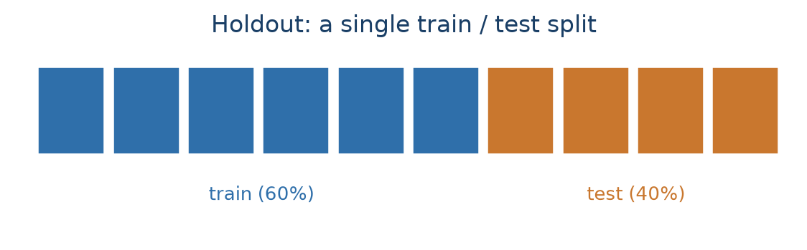
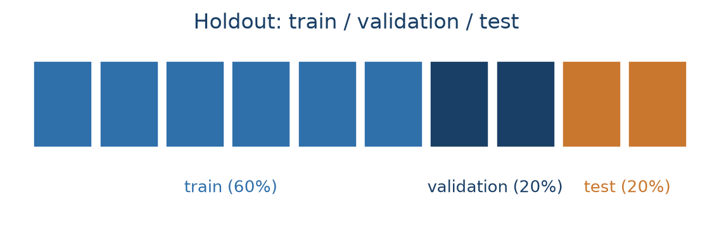
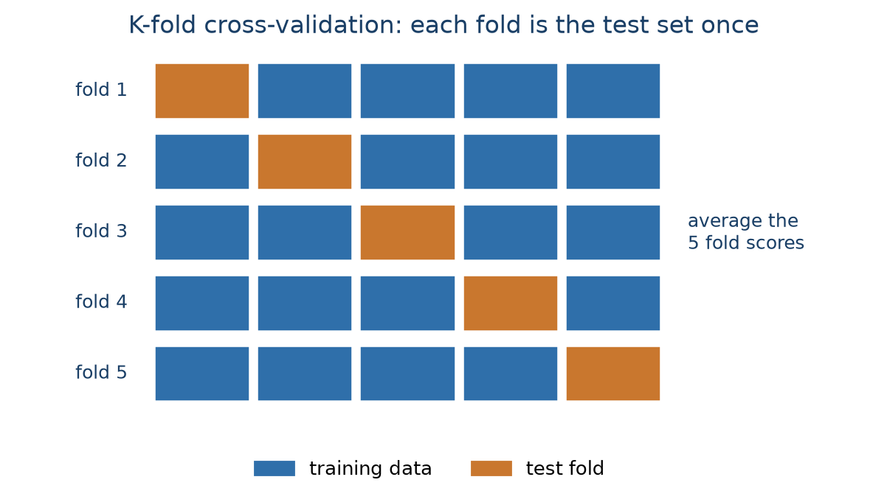
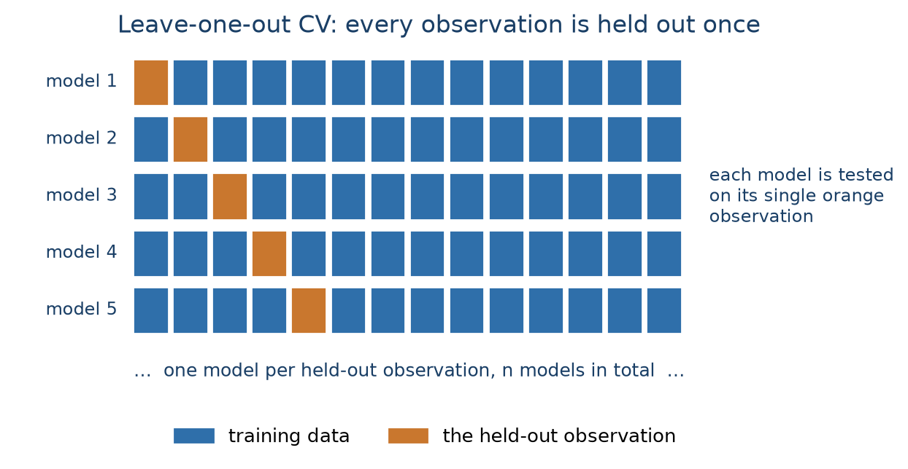
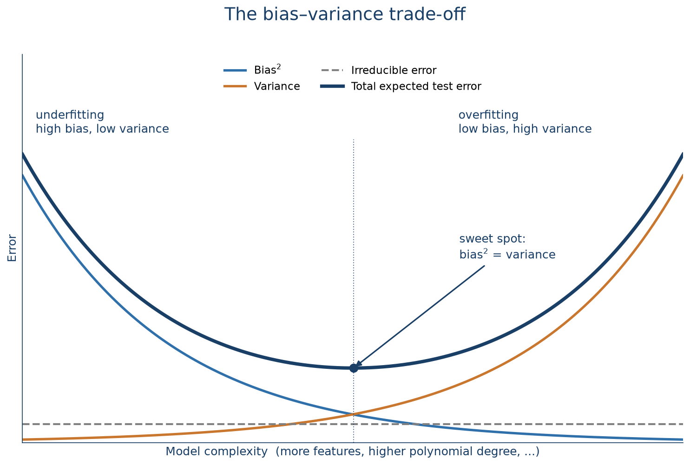

# Model Evaluation

The previous two chapters turned a raw tables into a clean, model-ready basetable. The
obvious next step is to fit a model to it. Before that's worth doing, though, we need to answer a
more basic question: *how would we even properly set up an experiment and how would we know if the model is any good?*

In CRISP-DM terms this is the **evaluation** phase, and it's where most predictive modelling
projects actually go wrong. The mistakes rarely happen in the modelling itself; they happen in
the **experimental setup**, the way the data is split into parts for learning and for testing.
Get that wrong and every performance number you report afterwards is fiction and unreliable. 

This chapter covers the two things you need before you can trust a model:

- **An experimental setup**: a sampling strategy that produces a fair, unseen sample to measure
  performance on (holdout, cross-validation, nested cross-validation, the bootstrap), plus the
  data-leakage traps that quietly break all of them.
- **Performance metrics**: how to actually score a model once you have an honest test set, for
  both regression and classification targets.

```{python}
import pandas as pd
import numpy as np
import matplotlib.pyplot as plt
import seaborn as sns

RANDOM_STATE = 123
```

## The experimental setup

The single most important principle in predictive modelling is that a model must be evaluated on
**unseen** data. Scoring a model on the same rows it was trained on is a self-fulfilling
prophecy: it will look accurate because you're checking patterns against the exact data those
patterns were extracted from. If every elderly customer in the training data happened to churn,
the model will "learn" that elderly customers churn, and score perfectly on that training data,
whether or not the relationship is real. Only data the model has never touched can tell you
whether a learned pattern generalizes well or not.

The fix is to split the available data into separate parts: one for *learning* the patterns,
another for *evaluating* them. Several strategies exist for doing that, and the rest of this section
works through them.

We'll use a compact **churn** basetable with just four predictors: a monetary score, a
transaction count, a recency score, and the number of days the customer has been active. This is
an RFM plus length-of-relationship feature set, exactly the kind discussed in the previous
chapter.

```{python}
basetable = pd.read_csv("../data/processed/basetable.csv")

print(f"Dataset shape: {basetable.shape}")
print(f"Churn rate: {basetable['churn'].mean():.3f}")
basetable.head()
```

```{python}
X = basetable.drop("churn", axis=1)
y = basetable["churn"]
```

### The holdout set: train and test

The simplest strategy is the **holdout set**: shuffle the data and split it once into a
**training set** to learn from and a **test set** to evaluate on (@fig-holdout-tt).

{#fig-holdout-tt fig-alt="A row of ten blocks, the first six blue and labelled train (60%), the last four orange and labelled test (40%)."}

Two practical points. We use a **60/40 split**: slightly more data in training (more training
data generally means a better model) while still leaving a substantial test set. And we set a
**random state** (seed) so the "random" sample is reproducible. That is essential while learning
and debugging, so everyone gets the same split. `stratify=y` keeps the churn rate the same in
both sets, which matters when the positive class is rare.

```{python}
from sklearn.model_selection import train_test_split

X_train, X_test, y_train, y_test = train_test_split(
    X, y, test_size=0.4, random_state=RANDOM_STATE, stratify=y
)

print(f"Training set: {X_train.shape[0]} rows ({X_train.shape[0] / len(X):.0%})")
print(f"Test set:     {X_test.shape[0]} rows ({X_test.shape[0] / len(X):.0%})")
print(f"Churn rate, train: {y_train.mean():.3f}, test: {y_test.mean():.3f}")
```

::: {.callout-note}
## A note on the split ratio

There is no universal rule for how much data to hold out. This book uses a 60/40 split, but
70/30 and 80/20 are also common, and scikit-learn's own `train_test_split` defaults to a 75/25
split when `test_size` and `train_size` are both left unspecified. The choice is a direct
trade-off, not a fixed convention: a bigger training set gives the model more to learn from and
lowers its bias, while a bigger test set gives a less variable, more trustworthy estimate of how
well it actually performs [@james2013introduction]. With a small or moderately sized dataset,
protecting the test-set estimate a bit more, as with a 60/40 split, is a reasonable choice.
:::

The holdout set is simple and works well on large samples (roughly 10,000+ rows). Its weakness is
that the test-set score depends on *which* rows happened to land in the test set: a different
random split can give a meaningfully different number.

### The holdout set: train, validation, and test

As soon as you compare several models or fine-tune hyperparameter set
tings, a plain train/test split isn't
enough. If you evaluate many candidate models on the test set and keep the best, you've effectively
tuned to that specific test set (also called *test-set torturing*) and its score is no longer an 
honest estimate of future performance.

The fix is a **three-way split** (@fig-holdout-tvt): a **training set** to fit models, a
**validation set** to compare them and pick the winner, and a **test set** that stays untouched
until the very end for the best, final, unbiased measurement. We'll use **60/20/20**. In `sklearn` 
this
takes two calls to `train_test_split`: first create the 20% test set, then split the remaining
80% into train (75% of 80% = 60%) and validation (25% of 80% = 20%).

{#fig-holdout-tvt fig-alt="A row of ten blocks: the first six blue and labelled train (60%), the next two dark navy and labelled validation (20%), the last two orange and labelled test (20%)."}

```{python}
X_temp, X_test, y_temp, y_test = train_test_split(
    X, y, test_size=0.2, random_state=RANDOM_STATE, stratify=y
)
X_train, X_val, y_train, y_val = train_test_split(
    X_temp, y_temp, test_size=0.25, random_state=RANDOM_STATE, stratify=y_temp
)

print(f"Train: {len(X_train)}  |  Validation: {len(X_val)}  |  Test: {len(X_test)}")
```

::: {.callout-warning}
## Two things people get wrong with the three-way split

**All data preparation belongs on the training set.** Bin width, imputation values, scaling
statistics, encodings: everything gets *fitted* from training data only, then applied or 
*transformed* unchanged
to validation and test. Fitting a scaler or an imputer on the full dataset leaks information
about the test rows into the model and makes the model overly optimistic.

**Never merge the validation and test sets.** It's fine (and recommended) to combine *train +
validation* to refit the final model once the hyperparameter is chosen (albeit not needed if the training set is sufficiently big). The test set stays separate.
:::

To make this concrete, let's tune one hyperparameter of a **K-nearest-neighbours (KNN)**
classifier. KNN classifies an observation by finding the *K* most similar observations in the 
training
data (by Euclidean distance) and taking a majority vote. *K* is a **hyperparameter**: it controls
the model's behaviour but isn't estimated from the data the way a regression coefficient is, so
we have to choose it ourselves by trying several values.

Because KNN uses distances, all features must be on the same scale, so we wrap a `StandardScaler`
and the classifier in a **pipeline**, which guarantees the scaler is fit on training data only
and the same transformation is reapplied to every other set. We score each *K* by AUC on the
validation set (AUC is covered later in this chapter; for now, read it as "higher is better, 0.5
is random").

```{python}
from sklearn.neighbors import KNeighborsClassifier
from sklearn.preprocessing import StandardScaler
from sklearn.pipeline import Pipeline
from sklearn.metrics import roc_auc_score

k_values = [3, 5, 10, 15, 20, 30, 50]
validation_scores = []

for k in k_values:
    pipeline = Pipeline([
        ("scaler", StandardScaler()),
        ("classifier", KNeighborsClassifier(n_neighbors=k)),
    ])
    pipeline.fit(X_train, y_train)
    val_probs = pipeline.predict_proba(X_val)[:, 1]
    validation_scores.append(roc_auc_score(y_val, val_probs))
    print(f"K={k:2d}: validation AUC = {validation_scores[-1]:.4f}")

plt.figure(figsize=(8, 4))
plt.plot(k_values, validation_scores, "o-", color="#2f6faa")
plt.xlabel("Number of neighbours (K)")
plt.ylabel("Validation AUC")
plt.title("KNN performance vs. K")
plt.grid(alpha=0.3)
plt.show()
```

Once the best *K* is identified on the validation set, we combine train + validation, refit the
final model on all of it, and touch the test set exactly once:

```{python}
best_k = k_values[int(np.argmax(validation_scores))]
best_val_score = max(validation_scores)

X_train_full = pd.concat([X_train, X_val])
y_train_full = pd.concat([y_train, y_val])

final_pipeline = Pipeline([
    ("scaler", StandardScaler()),
    ("classifier", KNeighborsClassifier(n_neighbors=best_k)),
])
final_pipeline.fit(X_train_full, y_train_full)

test_probs = final_pipeline.predict_proba(X_test)[:, 1]
test_auc = roc_auc_score(y_test, test_probs)

print(f"Best K = {best_k}  (validation AUC {best_val_score:.4f})")
print(f"Final test AUC: {test_auc:.4f}")
```

The small gap between validation and test AUC is normal. It's the natural variation between two
different random samples of the same data.

### Cross-validation

A single train/validation split has the same weakness as a single holdout: the score depends on
which rows landed where. **Cross-validation (CV)** averages that variation away. The data is cut
into *K* equally sized **folds**; each fold serves as the test set exactly once while the other
*K−1* folds train the model, giving *K* scores that get averaged (@fig-kfold).
**10-fold CV** is the most common choice in practice; but *K* = 5 is also a good compromise between
reliable estimates and computation time.

{#fig-kfold fig-alt="Five rows of five blocks. In each row a different block is orange (the test fold) and the other four are blue (training data); the orange block steps one position along the diagonal from row to row. A note reads: average the 5 fold scores."}

`sklearn`'s `cross_validate` handles all the splitting, fitting, and scoring internally. Here we
run it with a fixed KNN (*K* = 50) just to see how much a single split can vary. This is
sometimes called the **big outer loop**: cross-validation used only to estimate final
performance, with no hyperparameter tuning. We'll reuse this exact *K*-fold strategy twice more
below: first as the tuning mechanism *inside* a search, then wrapped *around* that search. The
"Nested cross-validation" section further down names these three roles precisely.

```{python}
from sklearn.model_selection import cross_validate, KFold

pipeline_cv = Pipeline([
    ("scaler", StandardScaler()),
    ("classifier", KNeighborsClassifier(n_neighbors=50)),
])
kfold = KFold(n_splits=10, shuffle=True, random_state=RANDOM_STATE)

cv_results = cross_validate(pipeline_cv, X, y, cv=kfold, scoring="roc_auc")
cv_scores = cv_results["test_score"]
test_auc_cv = cv_scores.mean()

plt.figure(figsize=(9, 4))
plt.plot(range(1, 11), cv_scores, "o-", color="#2f6faa")
plt.axhline(test_auc_cv, color="#c9772e", ls="--", label=f"Mean: {test_auc_cv:.4f}")
plt.xlabel("Fold")
plt.ylabel("AUC")
plt.title("10-fold cross-validation: AUC varies fold to fold (K=50)")
plt.legend()
plt.grid(alpha=0.3)
plt.show()

print(f"AUC ranges from {cv_scores.min():.4f} to {cv_scores.max():.4f}; mean {test_auc_cv:.4f}")
```

### Hyperparameter tuning with K-fold CV

In `sklearn`, `GridSearchCV` automates the inner train/validation loop: you give it a **pipeline**, a grid of
hyperparameter values, and a CV strategy, and it fits every combination, scores it by
cross-validation *within the training set*, keeps the best, and refits on the full training set,
all without ever touching the test set.

The workflow becomes: split off a test set manually (the **outer loop**), let `GridSearchCV` do
the validation splitting (the **inner loop**), and evaluate once on the test set at the end. This
is less code, harder to get wrong, and needs no manual refitting.

A single holdout split for the outer loop, combined with full *K*-fold CV for the inner loop, is
what's called the **big inner loop**: cheaper than also repeating the outer split, and the usual
choice in engineering and research settings, where getting the hyperparameter right matters more
than polishing the final performance number and the test set is already large enough to be reliable.

Below we tune *K* for KNN, but this time with `GridSearchCV`. The scoring metric is AUC, and the inner
CV loop is 10-fold. The final test set in the outer loop is already present  with the existing 20% holdout, and only touched once at the very end.

```{python}
from sklearn.model_selection import GridSearchCV

X_train, X_test, y_train, y_test = train_test_split(
    X, y, test_size=0.2, random_state=RANDOM_STATE, stratify=y
)

pipeline = Pipeline([
    ("scaler", StandardScaler()),
    ("classifier", KNeighborsClassifier()),
])
param_grid = {"classifier__n_neighbors": [3, 5, 10, 15, 20, 30, 50]}

grid_search = GridSearchCV(
    pipeline, param_grid, cv=kfold, scoring="roc_auc", n_jobs=-1
)
grid_search.fit(X_train, y_train)

test_probs_grid = grid_search.predict_proba(X_test)[:, 1]
test_auc_grid = roc_auc_score(y_test, test_probs_grid)

print(f"Best K = {grid_search.best_params_['classifier__n_neighbors']}")
print(f"Best CV AUC (mean of 10 folds): {grid_search.best_score_:.4f}")
print(f"Final test AUC: {test_auc_grid:.4f}")
```

`n_jobs=-1` tells `GridSearchCV` to use all CPU cores. The folds and hyperparameter settings are
independent, so they run in parallel and the search finishes much faster on larger grids.

### Nested cross-validation

Above, `GridSearchCV` gives a robust *hyperparameter* estimate, but the *final performance* number still
relies on one random train/test split. If that split happened to be favourable, the reported AUC
is not representative of the model's true performance.

Every example above is built from the same two roles, combined differently:

- The **outer loop** splits the data into training and test folds. It is used to estimate
  generalization performance: each outer test fold acts as a final, untouched holdout for
  scoring.
- The **inner loop** runs *inside* each outer training fold. It is used for hyperparameter
  tuning and model selection, choosing the best configuration before that configuration is ever
  scored on the outer test fold.

Cross-validation can play either role, or both at once, which gives potential setups:

- **Big outer loop**: *K*-fold CV in the outer loop, a simple holdout split for tuning in the
  inner loop. The plain 10-fold example above is the most simple case of this, where there's no
  hyperparameter to tune at all, so only the outer loop is left. Common in business and applied
  settings, where compute is limited and the model is often already fixed.
- **Big inner loop**: a single holdout split in the outer loop, full *K*-fold CV in the inner
  loop. This is exactly the `GridSearchCV` example above. Common in engineering and research
  settings, where the hyperparameter search matters more than a polished final estimate.
- **Fully nested CV**: *K*-fold CV in *both* loops. The most rigorous of the three,
  and the most expensive.

Hence, **fully nested cross-validation** is the fully nested setup and it removes the last dependence on a
single lucky split by running CV at two levels:

- an **outer loop** (e.g., 10-fold CV) that produces 10 independent train/test splits for performance
  estimation, and
- an **inner loop** (e.g., `GridSearchCV` with 10-fold CV) that tunes the hyperparameter separately
  *inside each outer training fold*.

@fig-nested draws this fully nested setup with 5-fold CV at both levels instead of 10. This makes it easier to visualize since each fold is
larger. However, the logic remains identical for any *K*. 

{#fig-nested fig-alt="Top: a row of five blocks, four blue (outer training data) and one orange (outer test fold), with a bracket and arrow pointing down from the training blocks, labelled one of 5 outer folds. Bottom: three of five rows of five blocks showing the inner 5-fold CV run only on that training data, one block per row in dark navy (the inner validation fold) and the rest blue (inner training data), with a note that inner scores are averaged to pick the hyperparameter before a final score on the outer test fold. A subtitle notes the same idea works for any K, e.g. 10-fold."}

The code below uses 10-fold at both levels, matching the rest of the chapter. The result is 10 performance estimates instead of one, which gives 
a mean, a standard deviation,
and a confidence interval, and no single lucky split can distort it. The cost is computation:
10 × 10 × 7 = 700 model fits instead of 70. As a rule of thumb, academic work favours fully
nested CV for maximum rigour; industry usually settles for the big inner loop (`GridSearchCV`,
inner CV only) for speed.

```{python}
nested_results = cross_validate(grid_search, X, y, cv=kfold, scoring="roc_auc", n_jobs=1)
nested_scores = nested_results["test_score"]
test_auc_nested = nested_scores.mean()

print(f"Mean AUC across 10 outer folds: {test_auc_nested:.4f}")
print(f"Standard deviation: {nested_scores.std():.4f}")
lo, hi = test_auc_nested - 1.96 * nested_scores.std(), test_auc_nested + 1.96 * nested_scores.std()
print(f"95% confidence interval: [{lo:.4f}, {hi:.4f}]")
```

Here the nested-CV mean lands almost exactly on the plain outer-loop mean from before, because
*K* = 50 really is the best setting for this data, so tuning inside each fold keeps picking it.
On a problem where the best hyperparameter is genuinely unknown (which is often the case with more complex models), the two would diverge, and the
nested estimate would be the trustworthy one.

### Leave-one-out cross-validation

**Leave-one-out cross-validation (LOOCV)** is *K*-fold CV taken to its extreme: *K* equals the
number of rows, so each model trains on all data but one row and is tested on that single
left-out row (@fig-loocv). It uses almost all the data for training every time, but it needs *n*
model fits, which is impractical for anything but tiny datasets, and the per-fold test score
(right or wrong on one row) is extremely noisy.

{#fig-loocv fig-alt="Five rows of fourteen thin blocks. In each row a single block is orange (the held-out observation) and the rest are blue (training data); the orange block steps along one position per row. A note reads: one model per held-out observation, n models in total."}

We demonstrate it on a 500-row stratified subsample to keep the runtime reasonable:

```{python}
from sklearn.model_selection import LeaveOneOut

X_small, _, y_small, _ = train_test_split(
    X, y, train_size=500, random_state=RANDOM_STATE, stratify=y
)

loo = LeaveOneOut()
loo_preds, loo_true = [], []
for train_idx, test_idx in loo.split(X_small):
    pipeline_cv.fit(X_small.iloc[train_idx], y_small.iloc[train_idx])
    loo_preds.append(pipeline_cv.predict_proba(X_small.iloc[test_idx])[0, 1])
    loo_true.append(y_small.iloc[test_idx].iloc[0])

loocv_auc = roc_auc_score(loo_true, loo_preds)
print(f"LOOCV AUC ({len(y_small)} fits): {loocv_auc:.4f}")
```

The lower AUC here isn't LOOCV being "wrong": it's the much smaller training set (499 rows, only
a handful of churners per fit) doing worse than the models trained on tens of thousands of rows.
LOOCV is really only worth it for final evaluation on very small datasets.

### The bootstrap

The **bootstrap** builds a training set by sampling *n* rows **with replacement** from the data,
so some rows appear multiple times and, on average, about 36.8% never get drawn at all. Those
unused rows form the **out-of-bag (OOB)** test set. Repeating this many times gives a
distribution of scores, much like CV, but with training sets that stay the original size. Note that the bootstrap was mainly designed as a statistical resampling technique, not a true model evaluation method, so it is less common in practice than CV.
`sklearn` has no built-in bootstrap splitter, so we use `resample`:

```{python}
from sklearn.utils import resample

boot_scores = []
for i in range(50):
    X_boot, y_boot = resample(X, y, n_samples=len(X), random_state=RANDOM_STATE + i, stratify=y)
    oob_idx = X.index.difference(X_boot.index)
    pipeline_cv.fit(X_boot, y_boot)
    oob_probs = pipeline_cv.predict_proba(X.loc[oob_idx])[:, 1]
    boot_scores.append(roc_auc_score(y.loc[oob_idx], oob_probs))

boot_scores = np.array(boot_scores)
print(f"Bootstrap AUC: {boot_scores.mean():.4f} ± {boot_scores.std():.4f}  (50 iterations)")
```

### Comparing the resampling strategies

```{python}
methods = ["Holdout\n(3-way)", "Big outer loop\n(10-fold)", "Big inner loop\n(GridSearchCV)", "Fully nested\nCV", "LOOCV\n(500)", "Bootstrap\n(50)"]
scores = [test_auc, test_auc_cv, test_auc_grid, test_auc_nested, loocv_auc, boot_scores.mean()]

plt.figure(figsize=(9, 4))
bars = plt.bar(methods, scores, color="#2f6faa", alpha=0.85)
for bar, s in zip(bars, scores):
    plt.text(bar.get_x() + bar.get_width() / 2, bar.get_height() + 0.004, f"{s:.3f}",
             ha="center", fontsize=9)
plt.ylabel("AUC")
plt.title("The resampling strategies give similar answers here")
plt.ylim(min(scores) - 0.03, max(scores) + 0.03)
plt.xticks(fontsize=8)
plt.tight_layout()
plt.show()
```

For this dataset every strategy lands around AUC 0.74 to 0.75, which is itself reassuring: it
means the model is stable and not sensitive to how the data is split. In general:

- **Fully nested CV** is the most robust approach: an unbiased estimate with a confidence interval.
- **The big outer loop** (outer CV only) is a good compromise between speed and reliability, and is the usual choice in business research and applied settings.
- **The big inner loop** (`GridSearchCV`, inner CV only) gives reliable *hyperparameter* choices
  at a fraction of the cost, and is the usual industry choice. Works well when the test set is large enough to be trustworthy.
- **Single holdout splits** are fastest but least reliable: fine for quick exploration, risky for
  a final number.
- **LOOCV** is computationally impractical except on very small data.
- **The bootstrap** is an alternative to CV that keeps training sets at full size. However, it is less common in practice and has no built-in support in `sklearn`.

## Data leakage

Almost every broken experimental setup comes down to the same root cause: **data leakage**. This
is information from outside the training set (especially information about the target, about
the future or the test data) sneaking into the model. The model then "learns" things it could not possibly know at
prediction time, its measured performance is inflated, and its performances collapses on genuinely new data
[@kaufman2012leakage].

Leakage is fundamentally about **legitimacy**: which inputs would actually be available, and
accurate, at the moment you'd want a prediction. Three rules capture most of it:

- **The target is never an input.** Neither the target itself nor a proxy that's really a
  restatement of it.
- **No time machine.** Every feature must come from a time period strictly *before* the target
  is determined. A feature that's only recorded *after* the outcome is leakage even if it looks
  innocuous.
- **No peeking at the test set.** Every preprocessing step (scaling, imputation, encoding, feature selection) must be fit on training data only and applied unchanged to validation and test. 

Some classic examples:

- Predicting whether a prospect will *open a bank account*, with **account number** as a feature.
  You only get an account number once the account exists.
- Predicting *churn*, with an **interviewer ID** as a feature. Interviewers are assigned only
  *after* a customer has already been flagged as a likely leaver.
- Identifying prospects from **website keywords** that were actually scraped after those people
  became customers, so the keywords describe products they've already bought.
- Building a **WoE encoding** for payment type in a *churn* model (Chapter 5) using each payment type's churn proportion computed across the entire dataset, then splitting into train and test. Every test row's encoded value already reflects its own category's churn outcome, information the model isn't supposed to have before it makes a prediction.

::: {.callout-note}
## A famous mistake: feature selection outside the CV loop

You have 5,000 rows and 500 variables. To fight the curse of dimensionality, you run variable
selection **on the full dataset** to get down to 100 variables, then cross-validate a classifier
on those 100.

This is a classical example of data leakage. The variable selection step already looked or peeked at every row's label, including the
rows that later act as CV test folds, and chose features *because* they correlated with those
labels. Cross-validating afterwards can't undo that; on the contrary, each fold is now contaminated with information from the test set and the 
folds were never truly unseen. The key lesson here is that feature selection is part of *training* and must happen **inside** each CV fold, on 
the training portion only.
:::

**How do you detect it?** Performance that looks too good-to-be-true, is also often not true. For example, a churn model with AUC 0.99 should
raise suspicion before celebration. A large drop in performance once the model meets a genuinely new batch of
data, for example next month's customers, should also raise suspicion. That drop is leakage showing itself: the model looked
great on data it had secretly already seen, and it collapses once it can no longer cheat.

**How do you prevent it?**

- Decide on the time separation up front: know exactly which point in time separates "known" from
  "future" before touching the data and stick to this is in your preprocessing and splitting.
- Run *every* preprocessing step (scaling, imputation, encoding, feature selection) *inside* the
  cross-validation loop, never on the full dataset beforehand. In `sklearn`, a `Pipeline` passed
  to `cross_validate` or `GridSearchCV` does exactly this automatically.
- Keep a final holdout test set that is touched exactly once, at the very end, and never used for
  any other decisions along the way.

## The bias–variance trade-off

Choosing a model's **complexity** (e.g., how many features, what polynomial degree, how many 
parameters) is a balancing act between two kinds of error (@fig-bias-variance):

- **Bias** is error from a model too simple to capture the real relationship. High bias means
  **underfitting**: consistently wrong, in the same way, on training *and* test data. Your model is too simple. 
- **Variance** is how much the fitted model would change if you retrained it on a different
  sample. High variance means **overfitting**: the model has learned the training data's noise,
  so it does great on that data and poorly on anything new. This leads to stellar training performance but disappointing test performance. Your model is overly complex.

{#fig-bias-variance fig-alt="Line chart with model complexity on the x-axis and error on the y-axis. A decreasing curve labelled bias squared, an increasing curve labelled variance, a flat dashed line labelled irreducible error, and a U-shaped curve labelled total expected test error that reaches its minimum exactly where the bias squared and variance curves cross, marked as the sweet spot between an underfitting region on the left and an overfitting region on the right."}

Expected test error is roughly bias² + variance + an **irreducible** noise floor you can never
beat. Lowering one of the first two tends to raise the other, so there's an optimal complexity
where the total error is smallest. Increasing complexity beyond this (more variables, comples transformations trees) makes things *worse*, not better [@james2013introduction].

The synthetic example below shows things clearer. We generate data from a known quadratic relationship plus noise, then fit three models of increasing complexity:

```{python}
from sklearn.linear_model import LinearRegression
from sklearn.preprocessing import PolynomialFeatures
from sklearn.metrics import r2_score

np.random.seed(RANDOM_STATE)
x = np.arange(-50, 151)
y_true = 3 + 2 * x**2
y_noisy = y_true + np.random.normal(0, 4000, len(x))

def fit_poly(degree):
    Xp = PolynomialFeatures(degree=degree, include_bias=False).fit_transform(x.reshape(-1, 1))
    model = LinearRegression().fit(Xp, y_noisy)
    return model.predict(Xp)

pred_linear = fit_poly(1)
pred_quad = fit_poly(2)
pred_poly20 = fit_poly(20)

fig, ax = plt.subplots(figsize=(9, 5))
ax.scatter(x, y_noisy, s=15, color="#999999", alpha=0.6, label="Data")
ax.plot(x, pred_linear, color="#c9772e", lw=2, label=f"Linear: underfit (R²={r2_score(y_noisy, pred_linear):.3f})")
ax.plot(x, pred_poly20, color="#2f6faa", lw=2, label=f"Degree 20: overfit (R²={r2_score(y_noisy, pred_poly20):.3f})")
ax.plot(x, pred_quad, color="#1a3f66", lw=3, label=f"Quadratic: just right (R²={r2_score(y_noisy, pred_quad):.3f})")
ax.set_xlabel("x")
ax.set_ylabel("y")
ax.set_title("Same data, three complexities")
ax.legend()
ax.grid(alpha=0.3)
plt.show()
```

The linear model can't bend to the curve at all (underfitting, high bias). The degree-20
polynomial wiggles to chase individual noisy points (overfitting, high variance). Note that its
R² is *higher* than the quadratic's on this data, which is exactly why R² on the training data you
fit is a poor guide to a model's real quality. The quadratic matches the true relationship and will
generalise best to new data, even if its R² is lower on this particular training sample.

## Performance metrics

The demonstration above was easy because we *knew* the true relationship. In practice you don't,
which is why you need evaluation metrics, computed on a proper held-out set, to compare models and pick one.

### Regression metrics

Remember that a regression model doesn't output a class label, it outputs a **point estimate**: a 
single predicted number $\hat{y}$ for each unknown value $y$.
Evaluating the model means comparing these predictions to the actual values on a held-out set:
the closer $\hat{y}$ sits to $y$ across all test rows, the better the model. There is no single
"right" way to summarise that closeness, different metrics have their own strengths and weaknesses (e.g., how to weigh large errors, outliers, and scale differently) so it's common to look at several at once.

Four metrics cover most needs:

- **R²**: the proportion of variance in $y$ explained by $\hat{y}$ (higher is better, max 1). It
  is primarily a goodness-of-fit measure. On a test set it can even go **negative** if the model
  does worse than just predicting the mean. Note that when using a train and test split, the R² actually boils down to the squared correlation between $\hat{y}$ and $y$.
- **RMSE**: the root mean squared difference between $\hat{y}$ and $y$, in the same units as the
  target. It squares the errors, so large errors are penalised heavily (sensitive to outliers).
- **MAE**: the mean absolute difference between $\hat{y}$ and $y$, also in target units, but
  penalising all errors proportionally.
- **MAPE**: mean absolute *percentage* error. Scale-free and easy to communicate, but undefined
  when actual values are near zero. So be careful with this metric if you have small or zero values in your dependent variable.

Only R² is maximised; the rest are minimised.

To make this concrete, let's consdider a synthetic time series example: `x` is a time index, `y` is
profit in that period, and we want to predict future profit. We split it **chronologically**
rather than randomly (for a time series, the validation and test set must be the *later* periods): 
60% train, 20% validation, 20% test. Then we compare a linear, a quadratic, and a high-order polynomial fit.

```{python}
reg = pd.DataFrame({"x": x, "x2": x**2, "x4": x**4, "x5": x**5, "y": y_noisy})
train, val, test = reg.iloc[:121], reg.iloc[121:161], reg.iloc[161:]

linear_reg = LinearRegression().fit(train[["x"]], train["y"])
quad_reg = LinearRegression().fit(train[["x", "x2"]], train["y"])
poly_reg = LinearRegression().fit(train[["x4", "x5"]], train["y"])

val_pred = {
    "Linear": linear_reg.predict(val[["x"]]),
    "Quadratic": quad_reg.predict(val[["x", "x2"]]),
    "High-order poly": poly_reg.predict(val[["x4", "x5"]]),
}
```

Scoring the three candidate models on the validation set:

```{python}
from sklearn.metrics import mean_squared_error, mean_absolute_error

def mape(y_true, y_pred):
    return np.mean(np.abs((y_true - y_pred) / y_true))

rows = []
for name, pred in val_pred.items():
    rows.append({
        "Model": name,
        "R²": r2_score(val["y"], pred),
        "RMSE": np.sqrt(mean_squared_error(val["y"], pred)),
        "MAE": mean_absolute_error(val["y"], pred),
        "MAPE": mape(val["y"], pred),
    })
pd.DataFrame(rows).round(3)
```

The quadratic model wins on every metric. The linear model underfits: it systematically
underestimates the high values. The high-order polynomial overfits, producing poor
predictions off the training range. Refitting the quadratic on train + validation and scoring
once on the test set gives the final number:

```{python}
final_model = LinearRegression().fit(
    pd.concat([train, val])[["x", "x2"]], pd.concat([train, val])["y"]
)
test_pred = final_model.predict(test[["x", "x2"]])

print("Final quadratic model, test set:")
print(f"  R²   = {r2_score(test['y'], test_pred):.3f}")
print(f"  RMSE = {np.sqrt(mean_squared_error(test['y'], test_pred)):,.0f}")
print(f"  MAE  = {mean_absolute_error(test['y'], test_pred):,.0f}")
print(f"  MAPE = {mape(test['y'], test_pred):.3f}")
```

### Classification metrics

Classification needs different evaluation metrics: you can't average an "error" when every
prediction is either exactly right (1–1 or 0–0) or exactly wrong.

We switch back to the churn basetable, take a fresh **50/50 split** (so the test set is large
enough for stable metrics), and fit a **random forest** model. Random forests build hundreds of
decision trees and average them; they're one of the best off-the-shelf classifiers even without
tuning. You don't have to know the details of this model, but just see it as a good performing default model. Here the random forest is just a means to generate predictions to evaluate.

```{python}
from sklearn.ensemble import RandomForestClassifier

X_clf = basetable.drop("churn", axis=1)
y_clf = basetable["churn"]
X_tr, X_te, y_tr, y_te = train_test_split(
    X_clf, y_clf, test_size=0.5, random_state=RANDOM_STATE, stratify=y_clf
)

rf = RandomForestClassifier(n_estimators=100, random_state=RANDOM_STATE)
rf.fit(X_tr, y_tr)

y_proba = rf.predict_proba(X_te)[:, 1]
```

#### Scoring vs. deterministic classifiers

Before looking at any metric, it helps to be clear about what a classifier actually returns,
because that's what the rest of this section relies on [@hernandezorallo2012unified]. There are
two kinds:

- A **deterministic classifier** returns a class label directly, 0 or 1. There's nothing else to
  decide.
- A **scoring classifier** returns a continuous score in [0, 1] instead, or a score that shows
  confidence that the event (e.g., churn) will happen. That score only becomes a label once you pick a **cut-off** (or threshold): above it, predict 1; below it, predict 0.

Most models used in practice, including random forests, logistic regression, and gradient
boosting, are scoring classifiers. Random forest above is no exception: `rf.predict_proba`
gives its raw scores, `y_proba`, and `rf.predict` is simply what you get after applying
`sklearn`'s default cut-off of 0.5 to those same scores (a probability of exactly 0.5 is the one
edge case that rounds down to 0).

::: {.callout-note}
## A note on the word "probability"

This book, like most of `sklearn`'s documentation, calls a scoring classifier's
output a "probability." In practice, the raw score a model outputs is often not a genuine
probability: many popular classifiers are known to be poorly calibrated out of the box
[@niculescumizil2005predicting]. A classifier is **well-calibrated** if, for example, 80% of the
instances to which it assigns a 80% probability are actually members of that class. So a score of
0.8 across a group of customers should mean that roughly 80% of them actually churn, which for
most raw model outputs isn't true. Turning a raw score into something that behaves like a real
probability takes an extra step, **calibration**, or more rigorously, **conformal prediction**
[@manokhin2023conformal], which is a topic on its own and beyond the scope of this book. But it is worth keeping in mind that the "probabilities" you see here are not guaranteed to be probabilities in the strict sense and a purist would call them "scores" instead.
:::

Both kinds of classifier can be evaluated with the same starting point: the **confusion matrix**,
a cross-tabulation of actual versus predicted labels. For a deterministic classifier that's the
whole story; for a scoring classifier, the matrix (and therefore everything built on it) still
depends on which cut-off you chose. 

That split runs through everything that follows. **Threshold-dependent metrics**, like accuracy,
precision, recall, and the rest, are computed from the confusion matrix at one specific cut-off.
**Threshold-independent metrics**, ROC and AUC, precision-recall curves, lift, look instead at
how a scoring classifier performs across *every possible* cut-off at once. We cover the 
threshold-dependent metrics first,
then move on to the threshold-independent ones.

#### The confusion matrix and threshold-dependent metrics

The confusion matrix at a chosen threshold has four cells: true positives (tp) and true negatives
(tn), **false positives** (fp, predicted churn, when the customer did not: a type I error) and
**false negatives** (fn, missed a churner: a type II error).

Almost every threshold-dependent metric is just a different ratio of these four counts:

$$
\text{Accuracy} = \frac{TP + TN}{TP + TN + FP + FN}
\qquad\qquad
\text{Precision} = \frac{TP}{TP + FP}
$$

$$
\text{Recall (Sensitivity, TPR)} = \frac{TP}{TP + FN}
\qquad\qquad
\text{Specificity (TNR)} = \frac{TN}{TN + FP}
$$

$$
\text{FNR (miss rate)} = \frac{FN}{TP + FN} = 1 - \text{Recall}
\qquad\qquad
F_1 = 2 \cdot \frac{\text{Precision} \cdot \text{Recall}}{\text{Precision} + \text{Recall}}
$$

Recall and specificity each look at one actual class: of actual churners, how many did we catch
(recall), and of actual non-churners, how many did we correctly clear (specificity, also called
the **true negative rate**, TNR). Their complements are exactly the two error rates marked on the
confusion matrix above: 1 minus recall is the **FNR**, the type II error rate, and 1 minus
specificity is the **false positive rate (FPR)**, the type I error rate. Precision instead looks
at the predictions themselves: of everyone flagged as a churner, how many actually were one.

Two more metrics are built specifically for imbalanced data, where the positive class
is rare:

$$
\text{Balanced accuracy} = \frac{\text{Recall} + \text{Specificity}}{2}
\qquad\qquad
F_\beta = (1 + \beta^2) \cdot \frac{\text{Precision} \cdot \text{Recall}}{(\beta^2 \cdot \text{Precision}) + \text{Recall}}
$$

**Balanced accuracy** averages the per-class accuracies instead of counting rows: a model that
just predicts the majority class gets 50% here, not the inflated number plain accuracy would
give it, because a large majority class can no longer hide a near-zero recall on the minority
class. **$F_\beta$** generalises $F_1$ (the special case $\beta = 1$) to let you weight the two
error types by how much they actually cost: $\beta > 1$ weights recall more heavily, appropriate
when missing a churner is worse than a false alarm; $\beta < 1$ weights precision more, when a
false alarm is the more expensive mistake.

Let's see these metrics in action on the random forest model above, at the default 0.5 threshold:

```{python}
from sklearn.metrics import (confusion_matrix, accuracy_score, precision_score,
                             recall_score, f1_score, balanced_accuracy_score, fbeta_score)

y_pred = rf.predict(X_te)
cm = confusion_matrix(y_te, y_pred)

fig, ax = plt.subplots(figsize=(5, 4))
sns.heatmap(cm, annot=True, fmt="d", cmap="Blues", cbar=False,
            xticklabels=["No churn", "Churn"], yticklabels=["No churn", "Churn"], ax=ax)
ax.set_xlabel("Predicted")
ax.set_ylabel("Actual")
ax.set_title("Confusion matrix (threshold = 0.5)")
plt.show()

tn, fp, fn, tp = cm.ravel()
print(f"Accuracy:          {accuracy_score(y_te, y_pred):.4f}")
print(f"Balanced accuracy: {balanced_accuracy_score(y_te, y_pred):.4f}")
print(f"Precision:         {precision_score(y_te, y_pred):.4f}   (of predicted churners, how many churned)")
print(f"Recall:            {recall_score(y_te, y_pred):.4f}   (of actual churners, how many we caught)")
print(f"Specificity:       {tn / (tn + fp):.4f}   (of actual non-churners, how many we cleared)")
print(f"FNR:               {fn / (fn + tp):.4f}   (of actual churners, how many we missed)")
print(f"F1-score:          {f1_score(y_te, y_pred):.4f}   (harmonic mean of precision and recall)")
print(f"F2-score:          {fbeta_score(y_te, y_pred, beta=2):.4f}   (weights recall twice as much as precision)")
```

The numbers show the classic failure mode on imbalanced data. Accuracy looks great at 96%, but
that is almost entirely the 96% of customers who don't churn: specificity is 99.7%, the model
clears almost every non-churner. Balanced accuracy tells the true story: 52.3%, barely above the
50% coin flip, because it no longer lets the huge non-churn class hide the model's
near-zero recall. Recall itself confirms it: only 4.8% of actual churners are caught, an FNR
above 95%. At a 0.5 threshold the model almost never predicts churn, because churn probabilities
rarely climb above 0.5 when only ~4% of customers churn in the first place. Weighting recall more
heavily makes this even more visible: F2 drops to 0.058, below F1's already weak 0.086, because
F2 punishes the missed churners harder than F1 does. Every one of these numbers depends on the
threshold, which is exactly the weakness the next section addresses.

Let's drop the threshold to 0.05 and the picture changes completely:

```{python}
for t in [0.5, 0.05]:
    yp = (y_proba >= t).astype(int)
    tn, fp, fn, tp = confusion_matrix(y_te, yp).ravel()
    print(f"threshold {t:>4}:  recall {recall_score(y_te, yp):.3f}   "
          f"precision {precision_score(y_te, yp):.3f}   "
          f"specificity {tn / (tn + fp):.3f}   FPR {fp / (fp + tn):.3f}   "
          f"FNR {fn / (fn + tp):.3f}   accuracy {accuracy_score(y_te, yp):.3f}")
```

Recall jumps from 5% to 61%, and the FNR falls from 95% to 38%: three times as many churners
caught. That comes at a real cost. The false-alarm rate is read directly off specificity: it
drops from 99.7% to 78%, which is the same as saying the **false positive rate** (1 minus
specificity) rises from 0.3% to 22%, so far more non-churners now get incorrectly flagged.
Precision falls too, from 38% to 10%, but for a related, distinct reason: it's not a rate over
non-churners, it's the fraction of *flagged* customers who actually churn, and that fraction
drops because the flagged group now contains many more of those false alarms relative to the true
churners it also catches. Which trade-off is right depends entirely on the business context: a
retention campaign that's cheap per contact can afford more false positives to catch more real
churners; an expensive one-on-one intervention cannot.

#### Choosing a threshold deliberately

A fixed cut-off like `sklearn`'s default of 0.5 quietly assumes two things that often aren't
true: that the classifier's scores behave like well-calibrated probabilities (see the callout
above), and that 0.5 happens to match what the business actually needs. Neither assumption is
often the case. Comparing two classifiers at the same fixed cut-off can be misleading if their 
score
distributions differ: one model's recall can look like 0 and another's clearly positive purely
because their scores are scaled differently, not because one is genuinely worse. And even for a
single well-behaved classifier, there is no reason 0.5 should be the cut-off a business actually
wants to act on.

Three ways to pick a better one:

1. **Calibrate the scores first**, so a fixed cut-off means the same thing for every classifier.
   Out of scope for this book (see the callout above).
2. **Work with percentile ranks instead of raw scores.** Pick a cut-off so that a *fixed
   proportion* of the data is flagged, for example the top 10%, rather than trusting the raw
   score scale. A common heuristic is to set that proportion equal to the positive rate seen in
   training or validation.
3. **Post-tune the threshold after training**, searching for the threshold that maximises a
   chosen performance metric via cross-validation, so the choice isn't overfit to the training data.

Solution 2 is simple enough to do by hand:

```{python}
pos_rate = y_tr.mean()
cutoff_score = np.quantile(y_proba, 1 - pos_rate)
y_pred_pct = (y_proba >= cutoff_score).astype(int)

print(f"Training positive rate: {pos_rate:.3f}")
print(f"Score cut-off at that percentile: {cutoff_score:.3f}")
print(f"  recall    {recall_score(y_te, y_pred_pct):.3f}")
print(f"  precision {precision_score(y_te, y_pred_pct):.3f}")
print(f"  F1        {f1_score(y_te, y_pred_pct):.3f}")
```

Solution 3 does the same job more rigorously. `TunedThresholdClassifierCV` searches for the
threshold that maximises a chosen metric, using internal cross-validation . For churn, F1 
(balancing precision and recall) is a reasonable
target. Note the use of `StratifiedKFold`: with imbalanced data you always want folds that
preserve the class ratio.

```{python}
from sklearn.model_selection import TunedThresholdClassifierCV, StratifiedKFold

tuned = TunedThresholdClassifierCV(
    estimator=RandomForestClassifier(n_estimators=100, random_state=RANDOM_STATE),
    scoring="f1",
    cv=StratifiedKFold(n_splits=5, shuffle=True, random_state=RANDOM_STATE),
    n_jobs=-1,
)
tuned.fit(X_tr, y_tr)
y_pred_tuned = tuned.predict(X_te)

print(f"F1-optimal threshold: {tuned.best_threshold_:.3f}")
print(f"  recall    {recall_score(y_te, y_pred_tuned):.3f}")
print(f"  precision {precision_score(y_te, y_pred_tuned):.3f}")
print(f"  F1        {f1_score(y_te, y_pred_tuned):.3f}  (was {f1_score(y_te, y_pred):.3f} at 0.5)")
```

The two solutions land in a similar place here: F1 around 0.24 either way, a real improvement
over the 0.085 the default 0.5 cut-off gave, but still modest in absolute terms. Threshold tuning
merely repositions the operating point; it doesn't make a weak classifier strong. Genuinely fixing
imbalanced-class performance needs resampling, cost-sensitive learning, a stronger model or a combination of these, which are all beyond the scope of this book.

#### Threshold-independent metrics: ROC and AUC

Often you don't know the operating conditions at evaluation time. For a retention campaign, the 
marketing budget, and so the fraction of customers you can target, may not be decided yet. 
**Threshold-independent** metrics sidestep this by aggregating over *all* thresholds at once.

The **ROC curve** plots the true positive rate (recall) against the false positive rate
(1 − specificity) as the threshold sweeps from 1 down to 0 [@fawcett2006introduction]. Two
corners anchor it: a perfect model reaches the top-left corner (100% TPR, 0% FPR), a model that
gets everything backwards sits in the bottom-right (0% TPR, 100% FPR), and the diagonal between
them is what pure random guessing looks like. The closer a curve hugs the top-left corner, the
better the trade-off it offers across every threshold at once, which also makes ROC curves useful
for comparing two classifiers directly: whichever curve dominates (sits above the other almost
everywhere) is the better model, threshold for threshold.

The **area under the curve (AUC)** collapses that whole curve into one number:

$$
\text{AUC} = \int_0^1 TPR(FPR) \; d(FPR)
$$

The integral has a cleaner, ranking-based interpretation in practice: the probability that a
randomly chosen positive instance (e.g., churn) is scored higher than a randomly chosen negative 
instance (e.g., non-churn). A random classifier scores 0.5; a perfect one scores 1.

```{python}
from sklearn.metrics import roc_curve, roc_auc_score

fpr, tpr, _ = roc_curve(y_te, y_proba)
auc = roc_auc_score(y_te, y_proba)

plt.figure(figsize=(6, 5))
plt.plot(fpr, tpr, color="#c9772e", lw=2, label=f"Random forest (AUC = {auc:.3f})")
plt.plot([0, 1], [0, 1], color="#1a3f66", lw=1.5, ls="--", label="Random")
plt.xlabel("False positive rate (1 - specificity)")
plt.ylabel("True positive rate (sensitivity)")
plt.title("ROC curve")
plt.legend(loc="lower right")
plt.grid(alpha=0.3)
plt.show()
```

The random forest model reaches an AUC of 0.764: pick a random churner and a random non-churner 
from
the test set, and about 76% of the time the churner gets the higher score, comfortably better
than the 0.5 a random classifier would get, but far from the 1.0 of a perfect one. Reading a
single point off the curve makes the trade-off concrete: to catch 80% of churners (TPR = 0.8)
this model needs a false positive rate of roughly 53%, more than half of all non-churners flagged
along the way. That is exactly what AUC hides by summarising the whole curve: it judges the
overall ranking ability, but any one operating point on that curve can still be a poor deal in
business terms. AUC's single-number convenience has a deeper, well-documented catch too: it
implicitly weighs misclassification costs differently for different classifiers, which can make
it favour the wrong model when two classifiers are compared, and can lead to suboptimal model
selection in terms of actual profit [@verbraken2013novel]. That critique is beyond the scope of
this book, but worth knowing the number isn't as theoretically clean as it
looks. 

#### Precision–recall curves and average precision

On strongly imbalanced data, ROC/AUC can be misleading too, even producing overly optimistic 
results. Since the false positive rate has a huge true-negative denominator, so it stays low even 
when the model is producing many false
alarms in absolute terms [@vanbelle2022inductive]. The **precision–recall (PR) curve** ignores
true negatives entirely and
focuses on the minority class. Its summary number, **average precision (AP)** or 
**area under the PR curve (AUC-PR)**, is the PR curve's alternative to AUC. Note that a random 
classifier's  AP equals the positive rate in the test set (its "no-skill" baseline).

```{python}
from sklearn.metrics import precision_recall_curve, average_precision_score

precision, recall, _ = precision_recall_curve(y_te, y_proba)
ap = average_precision_score(y_te, y_proba)
no_skill = y_te.mean()

plt.figure(figsize=(6, 5))
plt.plot(recall, precision, color="#c9772e", lw=2, label=f"Random forest (AP = {ap:.3f})")
plt.axhline(no_skill, color="#1a3f66", lw=1.5, ls="--", label=f"No-skill baseline ({no_skill:.3f})")
plt.xlabel("Recall")
plt.ylabel("Precision")
plt.title("Precision-recall curve")
plt.legend(loc="upper right")
plt.grid(alpha=0.3)
plt.show()

print(f"AUC = {auc:.3f}  vs  AP = {ap:.3f}  (no-skill AP = {no_skill:.3f})")
```

The gap tells the story: an AUC of ~0.76 sounds healthy, but the AP of ~0.16, against a no-skill
baseline of ~0.04, is a more realistic read of how the model does at actually pinpointing churners.

#### ROC vs. PR: a worked comparison

A workable decision rule for imbalanced problems is to look at **both** curves. If the ROC curves
don't cross, pick the dominant one on AUC. If they cross, or the AUC gap is small (under ~0.02),
fall back to **AP** and the **PR curves** instead, since that ambiguous case is exactly where
ROC/AUC's optimism on imbalanced data can hide a real difference between models.

Here it is in practice, comparing random forest against logistic regression:

```{python}
from sklearn.linear_model import LogisticRegression

lr = Pipeline([
    ("scaler", StandardScaler()),
    ("classifier", LogisticRegression(random_state=RANDOM_STATE, max_iter=1000)),
]).fit(X_tr, y_tr)

rf_proba = y_proba
lr_proba = lr.predict_proba(X_te)[:, 1]

fig, axes = plt.subplots(1, 2, figsize=(13, 5))
for name, p, color in [("Random forest", rf_proba, "#2f6faa"), ("Logistic regression", lr_proba, "#c9772e")]:
    f, t, _ = roc_curve(y_te, p)
    axes[0].plot(f, t, color=color, lw=2, label=f"{name} (AUC = {roc_auc_score(y_te, p):.3f})")
    pr_p, pr_r, _ = precision_recall_curve(y_te, p)
    axes[1].plot(pr_r, pr_p, color=color, lw=2, label=f"{name} (AP = {average_precision_score(y_te, p):.3f})")

axes[0].plot([0, 1], [0, 1], "k--", alpha=0.5)
axes[0].set(xlabel="False positive rate", ylabel="True positive rate", title="ROC")
axes[0].legend(loc="lower right"); axes[0].grid(alpha=0.3)
axes[1].axhline(no_skill, color="gray", ls="--", alpha=0.7)
axes[1].set(xlabel="Recall", ylabel="Precision", title="Precision-recall")
axes[1].legend(loc="upper right"); axes[1].grid(alpha=0.3)
plt.tight_layout()
plt.show()
```

The AUCs are clsoe to each other and the ROC curves cross, exactly the ambiguous case the
rule above is for. Falling back to AP settles the discussion: random forest's AP is clearly 
higher, so it's the pick.

The final call is still a business decision. A **high-precision** strategy (few, high-confidence
targets) suits a small retention budget; a **high-recall** strategy (catch as many churners as
possible, tolerate false alarms) suits a case where losing a customer is very costly; a
**balanced** strategy optimises F1 or ideally creates an explicit cost matrix tailored to the
specific business context [@verbeke2012newinsights; @verbraken2013novel].

#### Lift and top-decile lift

Retention campaigns rarely contact everyone: budgets are limited, so in practice a campaign
targets a fixed slice of the customer base, sorted by score, from the most likely churners down.
**Lift** measures how much better than random that targeting is and is especially useful for
evaluating the effectiveness of a model in identifying high-risk customers or for guiding
retention campaigns. Linking back to the confusion matrix, it is precision divided by the overall churn rate [@decaigny2018hybrid]:

$$
\text{Lift} = \frac{TP / (TP + FP)}{(TP + FN) / (TP + TN + FP + FN)}
$$

The numerator is precision at that cut-off: of the customers targeted, how many actually churn.
The denominator is the base rate: how many would churn if targeted at random. A lift of 1 means
the targeted slice is no more concentrated in churners than the population as a whole, the model
adds nothing; a lift of 3 means it is three times as concentrated.

The **top-decile lift (TDL)**, the lift at the cut-off that flags exactly the top 10% of
customers by score, is the most common single-number version in practice. Ten percent isn't
mathematically special: Neslin et al. (2006) showed that a retention campaign's expected profit
is a direct, increasing function of lift, which is why (top-decile) lift became one of the most
widely used performance criteria in churn prediction in the first place
[@verbeke2012newinsights; @decaigny2018hybrid].

```{python}
order = np.argsort(y_proba)[::-1]
top10 = order[: int(0.10 * len(y_te))]
top_decile_lift = y_te.iloc[top10].mean() / y_te.mean()
print(f"Top-decile lift: {top_decile_lift:.2f}x  (baseline churn rate {y_te.mean():.1%})")
```

The interpretation is direct: at the top 10%, the model detects 4.17 times more churners than a
random 10% of customers would, exactly the efficiency gain a limited retention budget is trying
to get.

::: {.callout-note}
## Why a fixed 10% cut-off can pick the wrong model

Fixing the cut-off at 10% by convention is still only a stand-in for whatever the real campaign
size will be, and that choice matters more than it looks. In practice, lift curves should be
compared directly: Verbeke et al. show two churn models whose lift curves *cross*, one has the
better lift at the top 5%, the other at the top 10% [@verbeke2012newinsights]. Picking a model on
top-decile lift can therefore mean walking away with the wrong one if the real campaign only
reaches the top 5%, or vice versa. Since expected profit is a direct function of lift at whatever
fraction is actually used, the safe rule is to read lift at the fraction you genuinely intend to
target, not at a fixed 10% by habit. Fully profit-driven metrics remove that guesswork by
searching over every fraction directly [@verbraken2013novel], but that is beyond the scope of
this book.
:::

The **cumulative lift curve** extends the top decile lift to every possible campaign size, from 
the top 1% to
the whole population: at each point it's the cumulative churn rate among the highest-scored
customers divided by the overall rate. It starts highest at the very smallest, most
concentrated slice (lift of about 9 at the top 1% here), decays as more, less certain customers
are added, and settles at 1 once the whole population is targeted, since targeting everyone is
the same as targeting at random.

```{python}
from sklearn_evaluation.plot import lift_curve

y_proba_2d = np.column_stack([1 - y_proba, y_proba])
plt.figure(figsize=(7, 4))
lift_curve(y_te, y_proba_2d)
plt.tight_layout()
plt.show()
```


#### Cumulative gains and the KS statistic

The **cumulative gains chart** is the lift curve's close cousin, and the two are related by a
simple identity. Both share the same x-axis: the fraction of customers targeted, sorted from the
highest score down to the lowest, growing from the smallest slice to the whole population. Where
they differ is what the y-axis counts. Lift is a *ratio*, how concentrated is this slice compared
to random, so it starts high and decays toward 1 as more, less certain customers are added.
Gains is a *running total*, how many churners have been captured so far, so it starts at 0% and
climbs to 100% once everyone is included. The two are tied together exactly:

$$
\text{Gains}(x) = x \cdot \text{Lift}(x)
$$

Working that out in terms of the confusion matrix at the cut-off that targets fraction $x$ gives
an even cleaner formula:

$$
\text{Gains}(x) = \frac{TP}{TP + FN}
$$

That's exactly **recall**. The cumulative gains chart is nothing more than recall traced across
every possible cut-off instead of read at one fixed threshold: of all actual churners, what share
are in the group targeted so far. Targeting a larger fraction $x$ always trades a lower lift for
a larger absolute share of churners caught. Targeting the top 10% here captures roughly 40% of
all churners ($0.10 \times 4.17 \approx 0.42$, the same top-decile lift computed above, just read
as a running total instead of a ratio).

Let's see that in action, and read the cumulative gains at 10% directly off the chart:

```{python}
from sklearn_evaluation.plot import cumulative_gain

gains_at_10 = y_te.iloc[top10].sum() / y_te.sum()
print(f"Cumulative gains at 10%: {gains_at_10:.1%} of all churners captured")

plt.figure(figsize=(7, 4))
cumulative_gain(y_te, y_proba_2d)
plt.tight_layout()
plt.show()
```

The **Kolmogorov–Smirnov (KS) statistic** measures how well the scores *separate* the two
classes. It comes from a classic two-sample test: plot the cumulative distribution of scores
separately for churners and for non-churners, and KS is the largest vertical gap between those
two curves. Since TPR and FPR are themselves
just those two cumulative distributions read from the top down, that same gap shows up on the
ROC curve as `max(TPR - FPR)`. Hence, it is the widest vertical distance between the ROC curve and the diagonal.

Let's compute KS both ways and see that they agree:

```{python}
from scipy.stats import ks_2samp

ks_scipy = ks_2samp(y_proba[y_te == 1], y_proba[y_te == 0]).statistic

fpr, tpr, thresholds = roc_curve(y_te, y_proba)
ks_idx = np.argmax(tpr - fpr)
ks_roc = (tpr - fpr)[ks_idx]

print(f"KS statistic (two score distributions): {ks_scipy:.4f}")
print(f"KS statistic (max TPR - FPR on the ROC curve): {ks_roc:.4f}")
print(f"Reached at threshold {thresholds[ks_idx]:.3f}")

fig, axes = plt.subplots(1, 2, figsize=(12, 5))

sns.ecdfplot(y_proba[y_te == 0], ax=axes[0], color="#2f6faa", label="No churn")
sns.ecdfplot(y_proba[y_te == 1], ax=axes[0], color="#c9772e", label="Churn")
axes[0].axvline(thresholds[ks_idx], color="gray", ls="--", lw=1)
axes[0].set(xlabel="Predicted score", ylabel="Cumulative proportion",
            title="The two score distributions, and their widest gap")
axes[0].legend(loc="lower right")
axes[0].grid(alpha=0.3)

axes[1].plot(fpr, tpr, color="#2f6faa", lw=2, label=f"ROC (AUC = {auc:.3f})")
axes[1].plot([0, 1], [0, 1], "k--", alpha=0.5)
axes[1].vlines(fpr[ks_idx], fpr[ks_idx], tpr[ks_idx], color="#c9772e", lw=3,
               label=f"KS = {ks_roc:.3f}")
axes[1].set(xlabel="False positive rate", ylabel="True positive rate",
            title="The same gap, seen on the ROC curve")
axes[1].legend(loc="lower right")
axes[1].grid(alpha=0.3)
plt.tight_layout()
plt.show()
```

Both routes agree: KS = 0.396, reached at a score threshold of 0.05, the cut-off where the two
classes are most cleanly separated. That's a different threshold from the F1-optimal one found
earlier (0.207): maximising separation and maximising F1 don't have to agree. At this KS-optimal threshold the model would flag about 23% of customers as likely
churners, noticeably more than the 10% a typical campaign budget allows, a reminder that "the
threshold with the best statistical property" and "the threshold the business can actually act
on" are two different questions.

As a rule of thumb: KS below 0.2 is poor separation, 0.2 to 0.4 acceptable, 0.4 to 0.75 good, and
above 0.75 is either excellent or a sign of leakage worth investigating. At 0.396, this model
sits right at the top of the acceptable band, just short of good.

## Where we go from here

We now have both sides of a trustworthy evaluation: an experimental setup that produces an
honest test set, and metrics to score against it for regression and classification targets. The
models used throughout this chapter, KNN and random forests, were deliberately treated as black
boxes: useful for producing predictions to evaluate, not yet explained. The next chapter,
**Modeling**, opens up the two workhorses instead, **linear regression** and **logistic regression**, including how regularization keeps them from overfitting, so you understand not
just how to score a model but how the most widely used one actually works.
